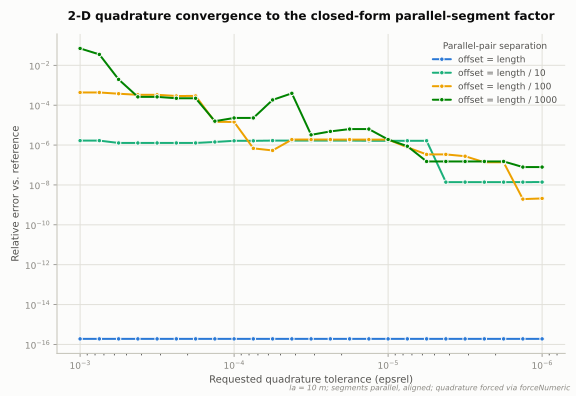
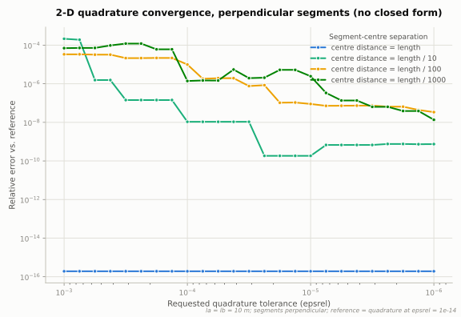

# TUPÃ — Theory Reference

This document states the electromagnetic model implemented by TUPÃ: the Hybrid
Electromagnetic Model (HEM), an application of the Method of Moments (MoM) to
lightning and grounding-system transients. It is the normative reference for
every implementation (Fortran, and future Python/Rust): where code and this
document disagree, one of them has a bug — and the discrepancy must be resolved
before the code is merged.

The formulation follows Portela [1] and the author's dissertation [3], with the
matrix assembly as used by Salari et al. [4] and validated against Visacro &
Soares [5]; Alípio's dissertation [22] derives the same HEM in detail in both
time and frequency domains and is a useful companion text. See
[references.md](references.md) for the full bibliography.

---

## 1. Model overview

A network of thin cylindrical conductors (in air and/or buried in soil) is
discretised into **segments** (electrodes) connected at **nodes**. Each segment
`j` carries:

- a **longitudinal current** flowing along its axis, represented by the currents
  at its two ends, `I₁(j)` and `I₂(j)`;
- a **transversal current** `Iₜ(j)` leaking from its lateral surface into the
  surrounding medium (conduction + displacement current), assumed uniformly
  distributed along the segment.

Each node `k` has a scalar potential (voltage to remote earth) `u(k)`.

The electromagnetic coupling between every pair of segments is condensed into
two full complex matrices at each angular frequency ω:

- **Zₜ** — transversal (nseg × nseg): mean scalar potential on segment *a* per
  unit transversal current injected by segment *b*;
- **Zₗ** — longitudinal (nseg × nseg): voltage drop along segment *a* per unit
  longitudinal current in segment *b*.

Circuit-type (Kirchhoff) relations between node voltages and segment currents
close the system, which is solved once per frequency. Time-domain responses are
obtained by inverse Fourier transform of the frequency sweep.

This is a frequency-domain, full-wave method restricted to thin-wire structures:
retardation and attenuation in dissipative media are kept, but the current
distribution within each segment is approximated as uniform (pulse basis
functions, point matching on averages — the classic MoM compromise, cf.
Harrington [6], Gibson [7]).

---

## 2. Conventions

Sign conventions are the single largest source of bugs in this class of code.
TUPÃ adopts **one** convention set; every routine must conform to it.

- **Time factor**: $\exp(+j\omega t)$ (electrical engineering convention). A quantity
  $X$ means the phasor of $x(t) = \text{Re}\{X \exp(j\omega t)\}$.
- **Medium immittance** (per volume element): $\sigma + j\omega\varepsilon$. All media are linear,
  isotropic, non-magnetic unless stated ($\mu = \mu_r\mu_0$).
- **Propagation constant**:

  $$\gamma = \sqrt{j\omega\mu (\sigma + j\omega\varepsilon)} = \alpha + j\beta, \quad \text{Re}\, \gamma \geq 0$$

  with the principal square root, so that the **propagation factor**

  $$F(R) = \exp(-\gamma R)$$

  decays with distance ($\alpha > 0$ in any lossy medium) and delays the phase.
- **Geometry**: right-handed Cartesian axes, `z` up. The air–soil interface is
  the plane `z = 0`; air occupies `z > 0`, soil `z < 0`.
- **Segment end currents**: both $I_1$ and $I_2$ are positive **into** the
  segment (from the node toward the segment). Hence

  $$I_\ell = \frac{I_1 - I_2}{2} \quad \text{(mean longitudinal current)}$$
  $$I_t = I_1 + I_2 \quad \text{(total transversal / leakage current)}$$

> **Mapping to the literature.** Portela [1] and the dissertation [3] use the
> physics convention $\exp(-i\omega t)$, in which the immittance appears as $\sigma - i\omega\varepsilon$,
> the wavenumber is $k = \sqrt{\mu\varepsilon\omega^2 + i\omega\mu\sigma}$ and the propagation factor is
> $\exp(+ikR)$. The two notations are complex conjugates of each other:
> $\gamma = j \cdot \text{conj}(k)$, and $\exp(-\gamma R) = \text{conj}(\exp(+ikR))$. Results (impedance moduli,
> time-domain waveforms) are identical; phases are conjugated. Any code mixing
> the two conventions in a single expression is wrong.
>
> **Legacy caveat.** The original Matlab TUPÃ (the model reference of record,
> see references.md) mixes the two conventions term by term: its immittance
> ($\sigma + j\omega\varepsilon$) and propagation factor (decaying
> $\exp(-jkR)$ with $k^2 = \omega^2\mu\varepsilon - j\omega\mu\sigma$, i.e.
> $\exp(-\gamma R)$ exactly) follow the $\exp(+j\omega t)$ convention above, but
> its longitudinal constant is $-j\omega\mu/4\pi$ — the $\exp(-i\omega t)$
> sign. When cross-validating against the legacy codes, compare impedance
> moduli and time-domain waveforms, never raw phases.

---

## 3. Potentials of a segment source

For a homogeneous, lossy, unbounded medium and sinusoidal steady state, the
retarded potentials of the elementary sources are (Lorenz gauge):

**Point injected current** $I_t$ (total current, conduction + displacement):

$$\psi(r) = \frac{I_t}{4\pi(\sigma + j\omega\varepsilon)} \cdot \frac{\exp(-\gamma r)}{r}$$

This replaces $q/\varepsilon$ of electrostatics by $I_t/(\sigma + j\omega\varepsilon)$ — the continuity
equation in a dissipative medium ties injected current to charge.

**Current element** $I \,d\ell$ directed along the unit vector $\mathbf{\hat{u}}$:

$$\mathbf{A}(r) = \frac{\mu I \,d\ell}{4\pi} \cdot \frac{\exp(-\gamma r)}{r} \cdot \mathbf{\hat{u}}$$
$$\mathbf{E} = -j\omega\mathbf{A} - \nabla\psi$$

A thin cylindrical segment is treated as a line of such sources along its axis,
with the transversal current per unit length $i_t = I_t/l$ and the longitudinal
current $I_\ell$ both assumed **uniform** over the segment. Field points are taken
on the conductor surface (radius `r₀`), which regularises the self terms.

---

## 4. Mutual impedances

Let segment *a* have endpoints $A_1A_2$, length $l_a$, and segment *b* endpoints
$B_1B_2$, length $l_b$, both in the same medium. $R_{ab}$ is the distance between
the integration points on the two axes (or axis-to-surface for self terms).

**Transversal**: averaging the scalar potential produced by *b* over *a*, and
dividing by the total transversal current of *b*:

$$Z_t(a,b) = \frac{1}{4\pi l_a l_b (\sigma + j\omega\varepsilon)} \iint \frac{\exp(-\gamma R_{ab})}{R_{ab}} \, d\ell_a \, d\ell_b$$

**Longitudinal**: from the projection of the vector potential of *b* on *a*
(electric field $-j\omega\mathbf{A}$ integrated along *a*):

$$Z_\ell(a,b) = \frac{j\omega\mu}{4\pi} \iint \frac{\exp(-\gamma R_{ab})}{R_{ab}} \, (d\ell_a \cdot d\ell_b)$$

For straight segments $d\ell_a \cdot d\ell_b = \cos \theta_{ab} \, d\ell_a \, d\ell_b$ with $\theta_{ab}$ the
(constant) angle between the segment directions.

### 4.1 Geometry-factor separation

Evaluating the complex double integral at every frequency is expensive. TUPÃ
uses the separation introduced in [3]: write $R_{ab} = \bar{R}_{ab} + \Delta R$, where $\bar{R}_{ab}$
is the distance between segment midpoints. When the propagation factor varies
little over the segments ($|\gamma| \cdot \Delta R \ll 1$), it can be pulled out of the integral
at the mean distance:

$$Z_t(a,b) \approx \frac{\exp(-\gamma\bar{R}_{ab})}{4\pi l_a l_b (\sigma + j\omega\varepsilon)} \cdot g(a,b)$$
$$Z_\ell(a,b) \approx \frac{j\omega\mu \exp(-\gamma\bar{R}_{ab})}{4\pi} \cdot \cos \theta_{ab} \cdot g(a,b)$$

with the **geometry factor**, a purely real, frequency-independent quantity:

$$g(a,b) = \iint \frac{d\ell_a \, d\ell_b}{R_{ab}}$$

The matrices of geometry factors $G$, mean distances $\bar{R}$, direction cosines
$\cos \theta$, and inverse length products $1/(l_a l_b)$ are computed **once** per
geometry; the frequency loop then only evaluates medium constants and
propagation factors. This is the decisive optimisation over the plain HEM
(where the full integrals are redone per frequency, cf. [5]) and bounds the
segment length: the approximation requires segments short compared to the
wavelength in the medium (in practice $\lesssim \lambda/10$, a few metres for soil at 1 MHz).

The same separation was published independently by Lima et al. [11] as the
**modified HEM (mHEM)**, with error analysis and validation against the full
HEM on grounding grids; it is the default integration mode of the open-source
TAGS and PRTL-mHEM codes (references.md). Their published results are an
external validation of this optimisation.

**Segmentation in practice.** Two families of rules coexist in the
literature: thin-wire-driven (segment length $\gtrsim 10\, r_0$, so the
thin-wire approximation holds — the classic HEM prescription [5]) and
wavelength-driven ($\lesssim \lambda/10$ at the highest frequency of
interest, as above). Schroeder, Moura & Machado [19] show parametrically
that, for tower-footing studies, much coarser meshes remain acceptable:
segments up to $\sim 1000\, r_0$ keep GPR peaks within 10 % and insulator
overvoltage peaks within 5 % of a fine-mesh reference, with speedups above
30×, because the outputs of interest are integral quantities insensitive to
the fine structure of the current distribution. Segment length is therefore
an accuracy/cost knob bounded below by the thin-wire condition and above by
$\lambda/10$; the project default stays $\lambda/10$, with coarsening per
[19] as a documented option for large studies.

### 4.2 Evaluating the geometry factor

- **Single-integral (mHEM) form** — preferred. The inner integral over a
  straight segment $b$ has a closed form: for a field point $p$ on segment
  $a$, with $r_1, r_2$ the distances from $p$ to the two ends of $b$,

  $$\int_0^{l_b} \frac{d\ell_b}{R} = \ln\left(\frac{r_1 + r_2 + l_b}{r_1 + r_2 - l_b}\right)$$

  (constant-$R$ sum defines prolate-spheroidal coordinates around $b$), so

  $$g(a,b) = \int_0^{l_a} \ln\left(\frac{r_1 + r_2 + l_b}{r_1 + r_2 - l_b}\right) d\ell_a$$

  — a 1-D adaptive quadrature of a smooth integrand [11]. Cheaper and
  better-conditioned than the double quadrature, especially for close
  segments.
- **General position, 2-D**: adaptive 2-D quadrature (nested Gauss–Kronrod
  7/15) of $1/R_{ab}$ over both segments. The integrand is smooth unless
  segments touch. Kept as the test oracle for the single-integral form.
- **Parallel segments** and **orthogonal segments**: closed-form expressions
  exist (logarithms and arctangents of the corner distances); see [3, annex]
  for the derivation. Used both as fast paths and as quadrature test oracles.

  

  The figure sweeps the 2-D quadrature's requested relative tolerance
  (`epsrel`; `setQuadEpsRel`/`getQuadEpsRel`, 8 points per decade from
  $10^{-3}$ down to $10^{-6}$, the library's default) against the
  closed-form `parallelGeometryFactor` as an independent oracle, for
  parallel 10 m segments at four separations. Looser tolerances only
  visibly degrade accuracy for close pairs — the far pair (offset = length)
  is already accurate to machine precision across the whole range — and
  each closer pair's error trends gradually and somewhat noisily downward
  as `epsrel` tightens, rather than collapsing sharply at one particular
  tolerance: e.g. offset = length/1000 goes from ~7 % relative error at
  `epsrel = 1e-3` down to ~$8\times10^{-8}$ by `epsrel = 1e-6`, with visible
  ups and downs along the way rather than a smooth curve. That gradual,
  non-monotonic trend (an occasional uptick between neighbouring `epsrel`
  values) is expected of an adaptive integrator honouring a tolerance
  rather than chasing machine precision regardless of what was asked for —
  the corrected behaviour after `Impedance.f90`'s embedded 7-point Gauss
  weights were fixed (they previously used the Kronrod weights at the
  Gauss nodes instead of the actual Gauss weights, so the error *estimate*
  never converged and every call over-refined to the interval cap
  regardless of `epsrel` — correct final values, but ~1000x slower and
  with no real tolerance control). This is why the closed form is the
  default fast path for parallel segments rather than a mere speed
  optimisation: even at the tightest practical tolerance shown here, the
  closest pairs still carry ~$10^{-7}$–$10^{-8}$ relative error against the
  closed form, which gives an exact answer for free instead. See the
  tolerance-sweep test in `fortran/test/test_geometry.f90` for the
  assertions this figure is drawn from.

  

  Perpendicular segments take the same quadrature path as the general
  position case — `mutualGeometryFactor` only fast-paths *parallel* pairs
  today, even though [3, annex] gives a closed form for the orthogonal case
  too (not yet ported here). With no closed form to check against, the
  oracle for this figure is instead the same quadrature at a very tight
  `epsrel = 1e-14`, swept over the same $10^{-3}$–$10^{-6}$ `epsrel` range
  as above, and the separation is the distance between the two segments'
  midpoints rather than a perpendicular offset. The qualitative
  picture matches the parallel case — the far pair is accurate immediately,
  closer pairs need progressively tighter `epsrel` and converge gradually
  rather than at one sharp threshold — confirming that the general 2-D
  quadrature path behaves the same way for both segment orientations, and
  that a future orthogonal closed form would earn the same trustworthiness
  argument `parallelGeometryFactor` already does today.
- **Coincident (self) factor**: for a segment of length $l$ and radius $r_0$,
  integrating axis-to-surface:

  $$g_{\text{self}} = 2 \left[ l \ln\left(\frac{l + \sqrt{l^2 + r_0^2}}{r_0}\right) - \sqrt{l^2 + r_0^2} + r_0 \right]$$

  Note $\ln\left(\frac{l+h}{h-l}\right) = 2 \ln\left(\frac{l+h}{r_0}\right)$ for $h = \sqrt{l^2+r_0^2}$, which explains
  the equivalent forms found in the literature. The identical expression is
  used by the open-source TAGS implementation (`self_integral`), an
  independent confirmation of this formula. Both legacy TUPÃ implementations
  had it wrong: the original Matlab computes
  $r_0 - h + l \ln\left(\frac{1+h}{r_0}\right)$ — half the correct value,
  with a literal `1` (one metre, dimensionally inconsistent) where $l$
  belongs in the log argument, so it is exact only for $l = 1$ m even after
  doubling — and the C++ port carries the same expression verbatim (see the
  ROADMAP, gap 8).

### 4.3 Self impedances

The self (diagonal) terms combine three effects:

$$Z_\ell(a,a) = Z_{\text{int}} + Z_{\text{ext}} + Z_{\text{interface}}$$
$$Z_t(a,a) = Z_{t,\text{ext}} + Z_{t,\text{interface}}$$

- $Z_{\text{ext}}$ uses the machinery of §4.1 with $g_{\text{self}}$ and $\bar{R} = r_0$ (field point
  on the conductor surface); $Z_{t,\text{ext}} = \frac{\exp(-\gamma r_0) g_{\text{self}}}{4\pi l^2 (\sigma+j\omega\varepsilon)}$.
- $Z_{\text{interface}}$ is the image contribution (§5).
- $Z_{\text{int}}$ is the **internal impedance** (skin effect). For a solid cylindrical
  conductor of radius $r_0$, conductivity $\sigma_c$, permeability $\mu_c$:

  $$z_{\text{int}} = \frac{\sqrt{j\omega\mu_c/\sigma_c}}{2\pi r_0} \cdot \frac{I_0(\rho)}{I_1(\rho)}, \quad \rho = r_0 \sqrt{j\omega\mu_c \sigma_c}$$
  $$Z_{\text{int}} = z_{\text{int}} \cdot l$$

  with $I_0, I_1$ modified Bessel functions. For tubular conductors (inner
  radius $r_i$) the standard Schelkunoff expression with $I$ and $K$ Bessel
  functions applies; see [3]. The legacy Matlab reference implements both
  cases in a single routine (solid when the inner radius is zero), including
  the large-argument limit of the Bessel ratio for numerical stability.

---

## 5. The air–soil interface: image method

Two half-spaces (air: $\sigma \approx 0, \varepsilon_0$; soil: $\sigma_s, \varepsilon_s$) meet at $z = 0$. The
boundary condition is represented by **images**: each segment has a mirror
image reflected through $z = 0$, and every impedance term gains an image
contribution evaluated with the image geometry factor $g_i$, image mean distance
$\bar{R}_i$, and the propagation constant of the medium containing the *real*
segments:

$$Z_t(a,b) = \frac{c_E}{l_a \, l_b} \left( \exp(-\gamma\bar{R}) g \pm \Gamma_t \exp(-\gamma\bar{R}_i) g_i \right)$$
$$Z_\ell(a,b) = c_M \, \cos \theta \, \exp(-\gamma\bar{R}) g \pm c_M \, \cos \theta_i \, \Gamma_\ell \exp(-\gamma\bar{R}_i) g_i$$

where

$$c_E = \frac{1}{4\pi(\sigma+j\omega\varepsilon)}$$
$$c_M = \frac{j\omega\mu}{4\pi}$$

and $\theta_i$ is the angle with the
image direction (the image of a segment reverses the sign of the z-component of
its direction vector).

In the current Fortran implementation the reflection coefficients are taken
at their ideal limits (also available as a runtime switch in the legacy
Matlab reference), which gives the sign rules:

| Configuration            | Transversal image | Longitudinal image |
| --- | --- | --- |
| Both segments in **soil** | `+` (add)        | `+` (add)          |
| Both segments in **air**  | `−` (subtract)   | `−` (subtract)     |
| Segments in different media | coupling neglected (set to 0) | idem |

Rationale: for buried conductors the air above is (nearly) non-conducting, so
the leakage current sees a "current mirror" of equal sign; for conductors in
air above a conducting soil, the soil approaches a potential boundary and the
image charge/current has opposite sign.

The general treatment uses frequency-dependent, quasi-static Fresnel-type
reflection coefficients (Portela [1] §2.4, [3]). For segments buried in soil
with immittance $W_s = \sigma_s + j\omega\varepsilon_s$, both TAGS and PRTL-mHEM
(references.md) use

$$\Gamma_t(\omega) = \frac{W_s - j\omega\varepsilon_0}{W_s + j\omega\varepsilon_0}, \qquad \Gamma_\ell = 1$$

applied to the image terms of $Z_t$ **and** $Z_\ell$ (PRTL-mHEM applies
$\Gamma_t$ to both; TAGS keeps them independent parameters). The **original
Matlab TUPÃ already implements exactly this coefficient** as its default
(non-ideal-soil) mode: assuming equal permeabilities it computes
$\Gamma = (k_1^2 - k_2^2)/(k_1^2 + k_2^2)$ between the media — algebraically
identical to $(W_1 - W_2)/(W_1 + W_2)$ — per frequency, and multiplies the
image parcels of both $Z_t$ and $Z_\ell$ by it (the PRTL-mHEM choice); the
C++ port dropped this and kept only the ideal limits. The ideal sign
rules in the table are the $|W_s| \gg \omega\varepsilon_0$ limit of these
coefficients; they degrade for high-resistivity soils toward the MHz range,
where $\Gamma_t$ acquires magnitude < 1 and phase. Implementing $\Gamma(\omega)$
in the Fortran code is a planned refinement (ROADMAP §7 P2) that
*restores* reference behaviour rather than adding to it; the cross-media
coupling (air segment ↔ buried segment) is second-order and is neglected, as
in both legacy codes (the Matlab returns zero for its "transmission"
condition pairs).

Even with $\Gamma(\omega)$, the image treatment is quasi-static and the HEM
family is regarded as accurate from DC up to a few MHz [19,20]. Kuhar,
Arnautovski-Toševa & Grčev [20] push this ceiling by replacing the
quasi-static images with **complex images** (the finitely conducting earth
replaced by a perfect conductor at a complex depth), recovering agreement
with full-wave NEC-4 solutions at higher frequencies. Lightning spectra
rarely require this, so it is noted as the refinement step *after*
$\Gamma(\omega)$, not planned work.

For the **self** terms the "mutual with the own image" appears with distance
$\bar{R}_i = 2h$ (twice the depth/height of the segment centre).

---

## 6. Nodal system

With $n_n$ nodes and $n_s$ segments, define the incidence matrices (all sparse,
entries 0 elsewhere):

- **A** ($n_s \times n_n$): row $j$ has $-1$ at column $n_1(j)$, $+1$ at $n_2(j)$;
- **B** ($n_s \times n_n$): row $j$ has $-\frac{1}{2}$ at both $n_1(j)$ and $n_2(j)$;
- **C** ($n_n \times n_s$): column $j$ has $+1$ at row $n_1(j)$;
- **D** ($n_n \times n_s$): column $j$ has $+1$ at row $n_2(j)$.

Three physical statements close the model ($\mathbf{u}$ = node voltages, $\mathbf{i}_1, \mathbf{i}_2$ = end
currents, both into the segment; $\mathbf{i}_e$ = external currents injected at nodes):

1. **Longitudinal voltage drop**: $u(n_1) - u(n_2) = Z_\ell \cdot I_\ell$

   $$\mathbf{A} \mathbf{u} + \frac{1}{2} Z_\ell \mathbf{i}_1 - \frac{1}{2} Z_\ell \mathbf{i}_2 = 0$$

2. **Mean surface potential from leakage**: $\frac{u(n_1) + u(n_2)}{2} = Z_t \cdot I_t$

   $$\mathbf{B} \mathbf{u} + Z_t \mathbf{i}_1 + Z_t \mathbf{i}_2 = 0$$

3. **KCL at each node** (currents leave the node into the segments):

   $$\mathbf{C} \mathbf{i}_1 + \mathbf{D} \mathbf{i}_2 = \mathbf{i}_e$$

Stacked as one linear system $Z_{\text{eq}} \mathbf{x} = \mathbf{y}$ of dimension $n_n + 2n_s$:

$$\begin{bmatrix}
\mathbf{A} & \frac{1}{2}Z_\ell & -\frac{1}{2}Z_\ell \\
\mathbf{B} & Z_t & Z_t \\
\mathbf{0} & \mathbf{C} & \mathbf{D}
\end{bmatrix}
\begin{bmatrix} \mathbf{u} \\ \mathbf{i}_1 \\ \mathbf{i}_2 \end{bmatrix} =
\begin{bmatrix} \mathbf{0} \\ \mathbf{0} \\ \mathbf{i}_e \end{bmatrix}$$

solved by dense LU (LAPACK `ZGESV`) once per frequency. Voltage sources are
converted to equivalent current injections (or handled by constraint rows) —
see the ROADMAP.

**Reduced form.** Eliminating $\mathbf{i}_1, \mathbf{i}_2$ yields the nodal admittance relation used
when only $\mathbf{u}$ is needed and $n_n \ll n_s$:

$$\mathbf{u} = Z_g \mathbf{i}_e, \quad Z_g = \left[ (\mathbf{D}-\mathbf{C}) Z_\ell^{-1} \mathbf{A} + \frac{1}{2} (\mathbf{C}-\mathbf{D}) Z_t^{-1} \mathbf{B} \right]^{-1}$$
$$\mathbf{i}_1 = -\left( Z_\ell^{-1}\mathbf{A} + \frac{1}{2} Z_t^{-1}\mathbf{B} \right) \mathbf{u}$$
$$\mathbf{i}_2 = \left(-Z_\ell^{-1}\mathbf{A} + \frac{1}{2} Z_t^{-1}\mathbf{B} \right) \mathbf{u}$$

This trades one $(n_n+2n_s)^2$ solve for two $n_s \times n_s$ solves plus a $n_n \times n_n$ solve
(cf. [1] eqs. 50–56, [4]). Both forms must give identical results — a useful
consistency test. The legacy Matlab reference exposes exactly this check as
switchable solver methods: the reduced form (backslash and explicit-inverse
variants), the augmented form (with LU and GMRES-fallback variants), and
additionally a TAGS-style symmetric block system in the unknowns
$(\mathbf{u}, I_\ell, I_t)$ (its "método 5").

> **Sign caveat.** The literature differs in the direction assumed for $\mathbf{i}_2$
> (Portela [1] takes it *out* of the segment at node $n_2$, flipping signs in B,
> D and the $\mathbf{i}_2$ blocks). The table above is self-consistent with the
> both-into-segment convention of §2. Implementations must verify against the
> DC limit (§9), not against any single paper's sign table. The legacy Matlab
> illustrates the trap: it stores the **D** incidence with entries $-1$ and
> compensates by assembling the KCL block as $[\mathbf{0}\ \mathbf{C}\ -\mathbf{D}]$
> (net effect identical to the table above), and it carries commented-out
> "Portela convention" sign variants next to the active ones.

---

## 7. Frequency-dependent soil

Soil $\sigma$ and $\varepsilon$ are strongly frequency dependent between DC and a few MHz;
ignoring this materially changes impulse impedances. TUPÃ models the soil
immittance $W(\omega) = \sigma(\omega) + j\omega \varepsilon(\omega)$ as a minimum-phase-shift system: the real
and imaginary parts are Hilbert-transform pairs, so a power-law model fitted to
measured $\sigma(\omega)$ fixes $\omega\varepsilon(\omega)$ as well (Portela [1] §1):

$$W(\omega) = \sigma_0 + \Delta\sigma \cdot \left[ 1 + j \tan\left(\frac{\pi \alpha}{2}\right) \right] \cdot \left(\frac{\omega}{\omega_0}\right)^\alpha$$

with $\sigma_0$ the low-frequency conductivity, $\alpha \in (0,1)$ the dispersion exponent
and $\Delta\sigma$ the dispersion magnitude at the reference frequency $\omega_0$ (commonly
$2\pi \cdot 1\, \text{MHz}$). The parameters `alpha0` and `kr` carried by `tPortelaSoil` correspond
to this model (`kr` scaling the dispersive parcel, $\tan(\pi\alpha/2)$ tying the
imaginary part). **Reference-frequency caveat**: the legacy Matlab codes this
model as $W = \sigma_0 + k_r[1 + j\tan(\pi\alpha/2)]\,\omega^\alpha$
(source: Portela [30]), i.e. $\omega_0 = 1$ rad/s — `kr` is the dispersive
magnitude at $\omega = 1$ rad/s, *not* at 1 MHz. A second legacy routine
implements the Lima–Portela variant [31],
$W = \sigma_0 + \Delta_i[\cot(\pi\alpha/2) + j](\omega/2\pi \cdot 10^6)^{\alpha}$,
which is the same family rewritten with
$\Delta\sigma = \Delta_i \cot(\pi\alpha/2)$ at $\omega_0 = 2\pi \cdot 1$ MHz;
any `tPortelaSoil` parameter set must state which reference frequency its
`kr` assumes. **Decision (ADR 0007, accepted 2026-07-05): `tPortelaSoil`
adopts the Lima–Portela form [31] with $\omega_0 = 2\pi \cdot 1$ MHz** —
legacy Matlab `kr` values (at $\omega_0 = 1$ rad/s) must be converted before
reuse. Per [ADR 0007](adr/0007-soil-dispersion-model.md), `tMaterial` admits
several dispersive-soil subtypes side by side, each named after its original
reference — `tPortelaSoil` (implemented first, matches the validation curves),
`tLongmireSmithSoil` (the 13-term Debye expansion of Longmire & Smith [15], as
parametrised by Cavka et al. [16], an alternative targeted by lightning
studies), `tVisacroAlipioSoil` (the measurement-based causal model of Visacro
& Alipio [13], condensed in [14] with recommended *mean* / *relatively
conservative* / *conservative* parameter sets — the default soil of the TAGS
and PRTL-mHEM codes), etc. All must reduce to the constant-parameter
(`tLinear`) medium as $\omega \to 0$. Cavka et al. [16] compare these models
side by side and are the reference for cross-checking any implementation.
The effect is not confined to grounding: Alipio, Duarte & De Conti [28] show
it materially changes underground-cable transients for $\rho > 1000$ Ω m
— dispersive soil should be the default, not the exception, in any transient
study.

---

## 8. Transient (time-domain) response

1. Sample the excitation waveform (e.g. Heidler or double-exponential lightning
   surge) and take its FFT.
2. Solve the frequency-domain system at the required frequencies; form the
   transfer function $H(\omega)$ between injected signal and each observed quantity.
3. Multiply and inverse-FFT.

Practical notes from [1] and [3]: 512–8192 frequencies in $[0, 1\, \text{MHz}]$ suffice
for lightning impulses; for large structures, the smooth behaviour of $H(\omega)$
allows computing a reduced set of frequencies and interpolating (analytic
fitting), drastically cutting run time. Logarithmic frequency spacing is the
project default for broadband sweeps. The legacy Matlab implements this
route literally: besides the plain FFT driver it ships a direct inverse
Fourier integral evaluated by adaptive quadrature over a spline interpolation
of the computed spectrum.

**Numerical Laplace Transform (NLT) refinement.** TAGS, PRTL and PRTL-mHEM
solve at complex frequencies $s = c + j\omega$ instead of $j\omega$, with damping
constant $c \approx \ln(N^2)/T$ (N samples, window $T$) and a data window
(Hanning, Blackman, …) applied before the inverse transform (Gómez & Uribe
[17]). The damping suppresses aliasing of the late-time response and Gibbs
oscillations; the plain FFT drive is the $c = 0$ special case. Since every
frequency-domain routine already takes a complex constant, supporting NLT
only changes the sweep driver, not the physics kernels. Note the two sweep
modes serve different purposes and use different axes: *harmonic response*
(log-spaced, real $\omega$) and *transient* (linearly spaced $s_k$, as the
IFFT/NLT grid requires).

**Why frequency domain at all.** The frequency-domain route assumes
linearity: no soil ionisation, arresters or corona. When those matter, the
HEM family offers a direct time-domain variant, HEM-TD (Pereira & Silveira
[21]), which carries the dispersive soil as a rational (pole–residue) model
evaluated in time and is benchmarked against the frequency-domain HEM. TUPÃ
is linear by design and stays in the frequency domain; the transfer
functions it produces can instead be *exported* to EMT programs
(ATP/EMTP/PSCAD) as rational models or frequency-dependent network
equivalents — fitting topology, order and passivity issues are treated by
Lima et al. [26] and Salarieh [27]. Such an export is a potential output
format, not part of the solver.

---

## 9. Validation anchors

Every implementation must reproduce, within stated tolerance:

1. **DC limit, buried horizontal conductor** (length $l$, radius $r_0$, depth
   $h$, soil $\sigma$): grounding resistance from the classical image formula (Sunde/Dwight form)

   $$R = \frac{1}{2\pi \sigma l} \left[ \ln\left(\frac{2l}{r_0}\right) + \ln\left(\frac{2l}{2h}\right) - 2 + \ldots \right]$$

   — the low-frequency asymptote of the full model.
2. **Portela 1997 [2]** application curves: harmonic input impedance of a 10 m
   buried conductor, 0.5 m depth, $\sigma = 0.01\, \text{S/m}$, $\varepsilon_r \approx 10$, from 100 Hz to 1 MHz
   (project reference test; 5 % tolerance). **Data caveat** (author,
   2026-07-05): no tabulated reference data exists — only the published
   equations and figures — so until further validation references are
   supplied, the executable oracle for this case is the cross-code check
   (item 6); status in [BENCHMARKS.md](BENCHMARKS.md).
3. **Visacro & Soares 2005 [5]**: formulation reference only — the paper
   carries no data usable for quantitative comparison (author, 2026-07-05);
   dropped as a data anchor.
4. **Internal consistency**: full $Z_{\text{eq}}$ solve vs. reduced $Z_g$ form;
   quadrature geometry factor vs. closed-form parallel/orthogonal formulas;
   reciprocity ($Z_t$, $Z_\ell$ symmetric); passivity ($\text{Re}\{Z_{\text{in}}\} \geq 0$).
5. **Grcev & Heimbach 1997 [18]**: harmonic impedance of square grounding
   grids — exercises many segments, right angles and the image terms; the
   TAGS examples reproduce it, enabling a three-way comparison.
6. **Cross-code check**: TAGS (references.md) is open source, builds locally,
   and accepts the same geometries — run identical cases and compare input
   impedance and node voltages. Compare *physical outputs only*, not raw
   matrices: TAGS assembles $Z_\ell$ with $|\cos\theta|$ and its own incidence
   conventions (a valid convention set paired with its solver, but different
   from §2), and its "immittance" system uses unknowns $(\mathbf{u}, I_\ell, I_t)$
   in a symmetric block layout rather than §6's $(\mathbf{u}, \mathbf{i}_1, \mathbf{i}_2)$.

---

## 10. Positioning: TUPÃ vs. the classic MoM and companion codes

Methodology and premises of this model against Harrington's original Method
of Moments [6] and the three open-source companion codes inspected in
references.md. TUPÃ column = the model specified by this document (planned
items marked). See the ROADMAP §7 for the adoption proposals that
came out of this comparison.

| Aspect | Harrington MoM [6] | **TUPÃ (this doc)** | TAGS (C99) | PRTL-mHEM (Python) | PRTL (Wolfram/CDF) |
| --- | --- | --- | --- | --- | --- |
| Target problem | General field problems (antennas, scattering) as integral equations | Lightning/grounding transients, thin-wire structures | Grounding system transients | Line lightning performance incl. mHEM grounding | Line lightning performance; grounding imported from file |
| Unknowns | Expansion coefficients of the current distribution | $(\mathbf{u}, \mathbf{i}_1, \mathbf{i}_2)$: node voltages + segment end currents (§6) | $(\mathbf{u}, I_\ell, I_t)$ symmetric block system, or nodal $\mathbf{u}$ only | Nodal $\mathbf{u}$ (admittance reduction) | Nodal network quantities (Laplace domain) |
| Basis / testing | Arbitrary (Galerkin, point matching, …) — the general framework | Pulse basis per segment; matching on segment averages | idem | idem | n/a (circuit/TL level) |
| Coupling integrals | Full Green's-function integrals, re-evaluated per frequency | Frequency-independent geometry factor $g$, $\exp(-\gamma\bar R)$ at midpoint distance (§4.1); $g$ via 1-D mHEM integral (§4.2, planned) or 2-D quadrature | Selectable: double, single, mHEM, midpoint-only | mHEM (1-D integral, precomputed $P$, $P_i$) | n/a — line by TL theory; grounding external |
| Half-space interface | Not treated (homogeneous medium assumed) | Images; ideal signs $\pm 1$ today, $\Gamma_t(\omega)$ planned (§5) | Images with complex $\Gamma_\ell$, $\Gamma_t$ as free parameters | Images with $\Gamma_t(\omega)$ applied to both $Z_t$ and $Z_\ell$ | Earth return at TL level (line above lossy ground) |
| Cross-media coupling (air↔soil segments) | n/a | Neglected (§5) | Neglected | Neglected | n/a |
| Soil dispersion | n/a (σ, ε constants) | `tPortelaSoil` [1]; `tVisacroAlipioSoil` [13,14], `tLongmireSmithSoil` [15,16] planned (§7) | Alipio–Visacro [14] and Smith–Longmire [16] built in | Visacro–Alipio [13] | Delegated to the imported grounding data |
| Conductor internal impedance | None (PEC wires) | Solid Bessel (§4.3); tubular planned | None (neglected) | Solid + tubular Bessel | Tubular Bessel |
| Linear solve | Dense matrix inversion | Dense LU (`ZGESV`), full $Z_{\text{eq}}$; reduced $Z_g$ as consistency check (§6) | Dense LU; immittance or admittance path | Dense inversion of $Y_g$ | Dense (Mathematica `Inverse`) |
| Time domain | Out of scope (harmonic) | FFT↔IFFT (§8); NLT planned | NLT with damping + window filters [17] | NLT (damped $s_k$ grid) + separate harmonic mode | NLT (`nILT`) |
| Frequency axis | Single frequency | Log-spaced sweep (harmonic); linear grid for transients (§8) | Linear (example-defined, incl. log for harmonic studies) | Log (harmonic) / linear (transient) | Linear (NLT grid) |
| Parallelism | n/a | OpenMP on matrix fill (frequency loop under evaluation, plan §7 P6) | OpenMP over the frequency loop, single-threaded BLAS | None (NumPy internal) | None |
| Validation anchors | Analytic canonical cases | §9: Sunde DC, Portela [2], Visacro & Soares [5], Grcev [18], cross-code | Grcev [18], Visacro & Soares, Alipio, Sunjerga examples | Published line/grounding cases | Four 138 kV test cases [12] |

Premises shared by TUPÃ, TAGS and PRTL-mHEM (and inherited from [1,5],
i.e. the HEM family reading of Harrington's framework): thin-wire
approximation, uniform currents per segment (pulse basis), quasi-static image
treatment of the single air–soil interface, dense frequency-domain solve per
sample, linearity (no soil ionisation). Harrington's MoM is the general
umbrella: the HEM family fixes basis, testing and kernel choices and adds the
circuit-level closure (§6) that pure MoM does not have.

### 10.1 Neighbouring model families

The same problem is attacked in the literature by methods that trade accuracy
for speed (circuit and TL models), extend the HEM's validity (complex images,
time domain), or sit above it as full-wave oracles. Where TUPÃ stands
relative to each:

| Model family | Domain | Approach | Relation to TUPÃ | Refs |
| --- | --- | --- | --- | --- |
| HEM-TD | Time | HEM physics solved directly in time; dispersive soil via rational (pole–residue) models; time delays computed in time domain | Same physics, other domain; needed only for nonlinear phenomena (soil ionisation, arresters, corona) that TUPÃ excludes by design; benchmarked against frequency-domain HEM | [21] |
| HEM + complex images | Frequency | Earth replaced by perfect conductor at complex depth instead of quasi-static images | Extends the §5 image treatment beyond the few-MHz ceiling; the refinement step after $\Gamma_t(\omega)$ | [20] |
| HF circuit models | Frequency / EMT | Lumped RLC (with or without mutual coupling) derived from the MoM equations by successive approximations | Degenerate limit of §4–§6; [23] maps their error vs. a full-wave reference over length, resistivity and frequency — mutual coupling is the decisive HF ingredient (which HEM keeps in full) | [23] |
| TL-model + FDTD | Time | Per-unit-length parameters (frequency-dependent Z, Y) for counterpoise wires, solved by FDTD | Cheaper special-purpose model for parallel counterpoises; ≤5 % deviation from a full EM model; found effective length independent of wire separation | [24] |
| FDTD–PEEC hybrid | Time | 1-D FDTD for the line + PEEC for tower and lightning channel | Models the lightning-channel↔tower coupling that HEM-class tools (TUPÃ included) neglect; relevant for tower-surge, not grounding, accuracy | [25] |
| Full-wave MoM (NEC-4 class) | Frequency | Sommerfeld-integral treatment of the interface, sub-segment current expansion | The accuracy oracle above HEM: [20] and [23] use it as reference; no geometry-factor shortcut, so far costlier | [20,23] |
| Rational models / FDNE for EMT | s-domain → time | Vector fitting / matrix-pencil approximation of $Z_g(\omega)$, passivity-enforced, plugged into ATP/EMTP/PSCAD | A *consumer* of TUPÃ's output, not a competitor; effective length drives realization order and robustness | [26,27] |

Segmentation guidance ([19], §4.1) and the scope ceiling illustrated by the
200-MHz SW-TDR diagnostics application [29] round out the picture: below the
thin-wire limits, circuit models suffice; above a few MHz, complex images or
full-wave methods take over.
