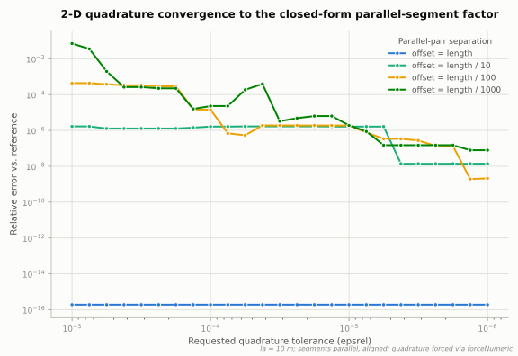
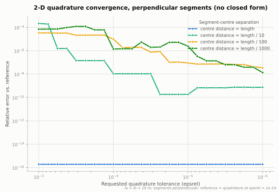

# TUPÃ — Theory Reference

This document states the electromagnetic model implemented by TUPÃ: the Hybrid
Electromagnetic Model (HEM), an application of the Method of Moments (MoM) to
lightning and grounding-system transients. It is the normative reference for
every implementation (Fortran, the Rust port in `rust/` — ROADMAP Phase 8;
Python is reserved for the GUI, ADR 0011): where code and this
document disagree, one of them has a bug — and the discrepancy must be resolved
before the code is merged.

The formulation follows Portela [1] and the author's dissertation [3], with the
matrix assembly as used by Salari et al. [4] and validated against Visacro &
Soares [5]; Alípio's dissertation [22] derives the same HEM in detail in both
time and frequency domains and is a useful companion text. See
[references.md](references.md) for the full bibliography.

---

## 1. Model overview

A network of thin cylindrical conductors (in air and/or buried in soil) is
discretised into **segments** (electrodes) connected at **nodes**. Each segment
`j` carries:

- a **longitudinal current** flowing along its axis, represented by the currents
  at its two ends, `I₁(j)` and `I₂(j)`;
- a **transversal current** `Iₜ(j)` leaking from its lateral surface into the
  surrounding medium (conduction + displacement current), assumed uniformly
  distributed along the segment.

Each node `k` has a scalar potential (voltage to remote earth) `u(k)`.

The electromagnetic coupling between every pair of segments is condensed into
two full complex matrices at each angular frequency ω:

- **Zₜ** — transversal (nseg × nseg): mean scalar potential on segment *a* per
  unit transversal current injected by segment *b*;
- **Zₗ** — longitudinal (nseg × nseg): voltage drop along segment *a* per unit
  longitudinal current in segment *b*.

Circuit-type (Kirchhoff) relations between node voltages and segment currents
close the system, which is solved once per frequency. Time-domain responses are
obtained by inverse Fourier transform of the frequency sweep.

This is a frequency-domain, full-wave method restricted to thin-wire structures:
retardation and attenuation in dissipative media are kept, but the current
distribution within each segment is approximated as uniform (pulse basis
functions, point matching on averages — the classic MoM compromise, cf.
Harrington [6], Gibson [7]).

---

## 2. Conventions

Sign conventions are the single largest source of bugs in this class of code.
TUPÃ adopts **one** convention set; every routine must conform to it.

- **Time factor**: $\exp(+j\omega t)$ (electrical engineering convention). A quantity
  $X$ means the phasor of $x(t) = \text{Re}\{X \exp(j\omega t)\}$.
- **Medium immittance** (per volume element): $\sigma + j\omega\varepsilon$. All media are linear,
  isotropic, non-magnetic unless stated ($\mu = \mu_r\mu_0$).
- **Propagation constant**:

  $$\gamma = \sqrt{j\omega\mu (\sigma + j\omega\varepsilon)} = \alpha + j\beta, \quad \text{Re}\, \gamma \geq 0$$

  with the principal square root, so that the **propagation factor**

  $$F(R) = \exp(-\gamma R)$$

  decays with distance ($\alpha > 0$ in any lossy medium) and delays the phase.
- **Geometry**: right-handed Cartesian axes, `z` up. The air–soil interface is
  the plane `z = 0`; air occupies `z > 0`, soil `z < 0`.
- **Segments and the interface**: each segment belongs wholly to one medium,
  assigned by the sign of its midpoint `z` (the Fortran `prepareStudy`
  takes midpoint $z \le 0$ as soil). Hence a node may lie on `z = 0` (e.g.
  the air/soil junction of `common/rod_air.json`), but a segment must not
  lie *in* the plane `z = 0` — its image coincides with itself, a degenerate
  image distance (§5) — and a conductor crossing the interface must be split
  there, so that no single segment spans both media. The `mesh` element
  enforces the first rule (ADR 0020); the `line` element does not yet.
- **Segment end currents**: both $I_1$ and $I_2$ are positive **into** the
  segment (from the node toward the segment). Hence

  $$I_\ell = \frac{I_1 - I_2}{2} \quad \text{(mean longitudinal current)}$$
  $$I_t = I_1 + I_2 \quad \text{(total transversal / leakage current)}$$

> **Mapping to the literature.** Portela [1] and the dissertation [3] use the
> physics convention $\exp(-i\omega t)$, in which the immittance appears as $\sigma - i\omega\varepsilon$,
> the wavenumber is $k = \sqrt{\mu\varepsilon\omega^2 + i\omega\mu\sigma}$ and the propagation factor is
> $\exp(+ikR)$. The two notations are complex conjugates of each other:
> $\gamma = j \cdot \text{conj}(k)$, and $\exp(-\gamma R) = \text{conj}(\exp(+ikR))$. Results (impedance moduli,
> time-domain waveforms) are identical; phases are conjugated. Any code mixing
> the two conventions in a single expression is wrong.
>
> **Legacy caveat.** The original Matlab TUPÃ (the model reference of record,
> see references.md) mixes the two conventions term by term: its immittance
> ($\sigma + j\omega\varepsilon$) and propagation factor (decaying
> $\exp(-jkR)$ with $k^2 = \omega^2\mu\varepsilon - j\omega\mu\sigma$, i.e.
> $\exp(-\gamma R)$ exactly) follow the $\exp(+j\omega t)$ convention above, but
> its longitudinal constant is $-j\omega\mu/4\pi$ — the $\exp(-i\omega t)$
> sign. When cross-validating against the legacy codes, compare impedance
> moduli and time-domain waveforms, never raw phases.

---

## 3. Potentials of a segment source

For a homogeneous, lossy, unbounded medium and sinusoidal steady state, the
retarded potentials of the elementary sources are (Lorenz gauge):

**Point injected current** $I_t$ (total current, conduction + displacement):

$$\psi(r) = \frac{I_t}{4\pi(\sigma + j\omega\varepsilon)} \cdot \frac{\exp(-\gamma r)}{r}$$

This replaces $q/\varepsilon$ of electrostatics by $I_t/(\sigma + j\omega\varepsilon)$ — the continuity
equation in a dissipative medium ties injected current to charge.

**Current element** $I \,d\ell$ directed along the unit vector $\mathbf{\hat{u}}$:

$$\mathbf{A}(r) = \frac{\mu I \,d\ell}{4\pi} \cdot \frac{\exp(-\gamma r)}{r} \cdot \mathbf{\hat{u}}$$
$$\mathbf{E} = -j\omega\mathbf{A} - \nabla\psi$$

A thin cylindrical segment is treated as a line of such sources along its axis,
with the transversal current per unit length $i_t = I_t/l$ and the longitudinal
current $I_\ell$ both assumed **uniform** over the segment. Field points are taken
on the conductor surface (radius `r₀`), which regularises the self terms.

### 3.1 Observation-point potentials (GPR, touch and step voltages)

The same segment-source potential, evaluated at an arbitrary observation
point $P$ *off* the conductors, is pure post-processing of a solved study
(no new unknowns): with the solved transversal currents $I_{t,b}$,

$$\psi(P) = \sum_b \frac{I_{t,b}}{4\pi l_b (\sigma + j\omega\varepsilon)}
\left( g_b(P)\, e^{-\gamma R_b} + \Gamma_t\, g_{b,i}(P)\, e^{-\gamma R_{b,i}} \right)$$

where $g_b(P) = \int_b d\ell/R$ is the §4.1 geometry factor with the field
point at $P$ (no self-regularisation needed off the wire), $R_b$/$R_{b,i}$
are midpoint distances to the segment and its image, and the image parcel
follows §5 (the legacy applies ideal images; the medium constants are those
of the medium containing $P$). This is exactly what the legacy Matlab
computes in its soil-potential and touch-potential outputs, and what TAGS
exposes as potential/field/step-and-touch post-processing (ROADMAP §7 P7):

- **GPR profile / surface potential**: $\psi$ evaluated on a line or grid of
  points at $z = 0$;
- **touch voltage** (legacy definition): $\max_P |\psi(P) - u_k|$ over a
  1 m-radius circle of points around a designated node $k$ (36 points in
  the legacy default) — a purely geometric definition, without IEEE Std 80's
  body-circuit and surface-layer derating factors [42];
- **step voltage**: difference of $\psi$ between surface points 1 m apart
  along a profile [42].

The observation-point geometry factor reuses the §4.2 machinery (closed
form for the collinear/parallel cases, quadrature otherwise), so the
single-integral mHEM kernel (§4.2) benefits this output as well.

---

## 4. Mutual impedances

Let segment *a* have endpoints $A_1A_2$, length $l_a$, and segment *b* endpoints
$B_1B_2$, length $l_b$, both in the same medium. $R_{ab}$ is the distance between
the integration points on the two axes (or axis-to-surface for self terms).

**Transversal**: averaging the scalar potential produced by *b* over *a*, and
dividing by the total transversal current of *b*:

$$Z_t(a,b) = \frac{1}{4\pi l_a l_b (\sigma + j\omega\varepsilon)} \iint \frac{\exp(-\gamma R_{ab})}{R_{ab}} \, d\ell_a \, d\ell_b$$

**Longitudinal**: from the projection of the vector potential of *b* on *a*
(electric field $-j\omega\mathbf{A}$ integrated along *a*):

$$Z_\ell(a,b) = \frac{j\omega\mu}{4\pi} \iint \frac{\exp(-\gamma R_{ab})}{R_{ab}} \, (d\ell_a \cdot d\ell_b)$$

For straight segments $d\ell_a \cdot d\ell_b = \cos \theta_{ab} \, d\ell_a \, d\ell_b$ with $\theta_{ab}$ the
(constant) angle between the segment directions.

### 4.1 Geometry-factor separation

Evaluating the complex double integral at every frequency is expensive. TUPÃ
uses the separation introduced in [3]: write $R_{ab} = \bar{R}_{ab} + \Delta R$, where $\bar{R}_{ab}$
is the distance between segment midpoints. When the propagation factor varies
little over the segments ($|\gamma| \cdot \Delta R \ll 1$), it can be pulled out of the integral
at the mean distance:

$$Z_t(a,b) \approx \frac{\exp(-\gamma\bar{R}_{ab})}{4\pi l_a l_b (\sigma + j\omega\varepsilon)} \cdot g(a,b)$$
$$Z_\ell(a,b) \approx \frac{j\omega\mu \exp(-\gamma\bar{R}_{ab})}{4\pi} \cdot \cos \theta_{ab} \cdot g(a,b)$$

with the **geometry factor**, a purely real, frequency-independent quantity:

$$g(a,b) = \iint \frac{d\ell_a \, d\ell_b}{R_{ab}}$$

The matrices of geometry factors $G$, mean distances $\bar{R}$, direction cosines
$\cos \theta$, and inverse length products $1/(l_a l_b)$ are computed **once** per
geometry; the frequency loop then only evaluates medium constants and
propagation factors. This is the decisive optimisation over the plain HEM
(where the full integrals are redone per frequency, cf. [5]) and bounds the
segment length: the approximation requires segments short compared to the
wavelength in the medium (in practice $\lesssim \lambda/10$, a few metres for soil at 1 MHz).
Lima et al. [11] locate where the separation starts to fail for their
20 × 20 m and 40 × 40 m grids in 1000 Ω·m soil: mHEM and full HEM agree
below ~4 MHz, then diverge steeply, which they attribute to the
non-uniformity of $\exp(-\gamma R)$ over the segment pair. TUPÃ's
reproduction of those curves shows the same onset
([validation/lima-fig7.md](validation/lima-fig7.md)).

The same separation was published independently by Lima et al. [11] as the
**modified HEM (mHEM)**, with error analysis and validation against the full
HEM on grounding grids; it is the default integration mode of the open-source
TAGS and PRTL-mHEM codes (references.md). Their published results are an
external validation of this optimisation.

Two neighbouring results from the same group bracket this choice. sHEM [59]
goes one step further and truncates $\exp(-\gamma r)/r$ to its two-term
MacLaurin series $1/r - \gamma$, which makes the double integrals fully
closed-form (no numerical integration at all, up to ~2000× faster than the
plain HEM) — but its error grows above ~100 kHz in high-resistivity soils,
exactly where the $\exp(-\gamma\bar R)$ factor retained here stays exact.
And Moura's thesis [58] applies this same mean-distance separation to
nonuniform *overhead* spans (catenaries, river crossings), evidence that the
approximation carries over from buried electrodes to the line conductors
TUPÃ models in air.

**Segmentation in practice.** Two families of rules coexist in the
literature: thin-wire-driven (segment length $\gtrsim 10\, r_0$, so the
thin-wire approximation holds — the classic HEM prescription [5]) and
wavelength-driven ($\lesssim \lambda/10$ at the highest frequency of
interest, as above). Schroeder, Moura & Machado [19] show parametrically
that, for tower-footing studies, much coarser meshes remain acceptable:
segments up to $\sim 1000\, r_0$ keep GPR peaks within 10 % and insulator
overvoltage peaks within 5 % of a fine-mesh reference, with speedups above
30×, because the outputs of interest are integral quantities insensitive to
the fine structure of the current distribution. Segment length is therefore
an accuracy/cost knob bounded below by the thin-wire condition and above by
$\lambda/10$; the project default stays $\lambda/10$, with coarsening per
[19] as a documented option for large studies (`numerics.maxSegmentLength`, a per-study
target: an element gets max(`segments`, ⌈length/target⌉) segments, so elements
that omit `segments` follow the target alone, coarse or fine — ADR 0024 §3). The error of coarsening has
a known sign: Silva's segmentation study for the pulse basis [49, §5.3]
(10 $r_0$ segments as the converged reference) finds that coarser
discretisations systematically *underestimate* $|Z(\omega)|$ and GPR — a
candidate cause of the mostly negative mid-band knee error in
[validation/silva2025-fig3.md](validation/silva2025-fig3.md).

### 4.2 Evaluating the geometry factor

- **Single-integral (mHEM) form** — the default quadrature since ROADMAP
  Phase 10 item 1 ([ADR 0024](adr/0024-phase10-numerics.md) §1;
  `mImpedance::geometryFactor1D`), with the parallel closed form as fast
  path. The inner integral over a
  straight segment $b$ has a closed form: for a field point $p$ on segment
  $a$, with $r_1, r_2$ the distances from $p$ to the two ends of $b$,

  $$\int_0^{l_b} \frac{d\ell_b}{R} = \ln\left(\frac{r_1 + r_2 + l_b}{r_1 + r_2 - l_b}\right)$$

  (constant-$R$ sum defines prolate-spheroidal coordinates around $b$), so

  $$g(a,b) = \int_0^{l_a} \ln\left(\frac{r_1 + r_2 + l_b}{r_1 + r_2 - l_b}\right) d\ell_a$$

  — a 1-D adaptive quadrature of a smooth integrand [11]. Cheaper and
  better-conditioned than the double quadrature, especially for close
  segments: 8× faster on 120 random non-parallel segments (14 400 pairs),
  agreeing with the 2-D path to 7.9e-8. The implementation takes the
  tolerance `epsrel` directly (`epsabs = 0`; the 2-D path scales it by the
  shorter segment), writes $r_1 + r_2 - l_b$ as
  $\rho^2\left[(r_1 + s)^{-1} + (r_2 + l_b - s)^{-1}\right]$ for a field point
  alongside $b$ (axial coordinate $s$, distance $\rho$ to the axis) to avoid
  cancellation, and clamps the logarithm's argument where a touching
  end point makes the integrand $+\infty$ on a single point (an integrable
  singularity; a T junction is resolved to 2e-7 by the bisection).
- **General position, 2-D**: adaptive 2-D quadrature (nested Gauss–Kronrod
  7/15) of $1/R_{ab}$ over both segments. The integrand is smooth unless
  segments touch. Kept as the test oracle for the single-integral form and
  selectable (`numerics.kernel: "double"`, CLI `--kernel double`).
- **Parallel segments** and **orthogonal segments**: closed-form expressions
  exist (logarithms and arctangents of the corner distances); see [3, annex]
  for the derivation. Portela's *Campos e Ondas* problem collection [32]
  works the same parallel and orthogonal configurations (and the buried
  conductor with its image) from first principles — the course-text ancestry
  of these formulas. Used both as fast paths and as quadrature test oracles.
  The geometry factor does not depend on either segment's orientation, so
  an implementation reverses one segment of an opposite-direction pair and
  needs only the same-direction form. The legacy opposite-direction
  branches are wrong for unequal lengths
  ([ADR 0017](adr/0017-legacy-reinspection-findings.md) finding 8).

  

  The figure sweeps the 2-D quadrature's requested relative tolerance
  (`epsrel`; `setQuadEpsRel`/`getQuadEpsRel`, 8 points per decade from
  $10^{-3}$ down to $10^{-6}$, the library's default) against the
  closed-form `parallelGeometryFactor` as an independent oracle, for
  parallel 10 m segments at four separations. Looser tolerances only
  visibly degrade accuracy for close pairs — the far pair (offset = length)
  is already accurate to machine precision across the whole range — and
  each closer pair's error trends gradually and somewhat noisily downward
  as `epsrel` tightens, rather than collapsing sharply at one particular
  tolerance: e.g. offset = length/1000 goes from ~7 % relative error at
  `epsrel = 1e-3` down to ~$8\times10^{-8}$ by `epsrel = 1e-6`, with visible
  ups and downs along the way rather than a smooth curve. That gradual,
  non-monotonic trend (an occasional uptick between neighbouring `epsrel`
  values) is expected of an adaptive integrator honouring a tolerance
  rather than chasing machine precision regardless of what was asked for —
  the corrected behaviour after `Impedance.f90`'s embedded 7-point Gauss
  weights were fixed (they previously used the Kronrod weights at the
  Gauss nodes instead of the actual Gauss weights, so the error *estimate*
  never converged and every call over-refined to the interval cap
  regardless of `epsrel` — correct final values, but ~1000x slower and
  with no real tolerance control). This is why the closed form is the
  default fast path for parallel segments rather than a mere speed
  optimisation: even at the tightest practical tolerance shown here, the
  closest pairs still carry ~$10^{-7}$–$10^{-8}$ relative error against the
  closed form, which gives an exact answer for free instead. See the
  tolerance-sweep test in `fortran/test/test_geometry.f90` for the
  assertions this figure is drawn from.

  

  Perpendicular segments take the same quadrature path as the general
  position case — `mutualGeometryFactor` only fast-paths *parallel* pairs
  today, even though [3, annex] gives a closed form for the orthogonal case
  too (not yet ported here). With no closed form to check against, the
  oracle for this figure is instead the same quadrature at a very tight
  `epsrel = 1e-14`, swept over the same $10^{-3}$–$10^{-6}$ `epsrel` range
  as above, and the separation is the distance between the two segments'
  midpoints rather than a perpendicular offset. The qualitative
  picture matches the parallel case — the far pair is accurate immediately,
  closer pairs need progressively tighter `epsrel` and converge gradually
  rather than at one sharp threshold — confirming that the general 2-D
  quadrature path behaves the same way for both segment orientations, and
  that a future orthogonal closed form would earn the same trustworthiness
  argument `parallelGeometryFactor` already does today.
- **Coincident (self) factor**: for a segment of length $l$ and radius $r_0$,
  integrating axis-to-surface:

  $$g_{\text{self}} = 2 \left[ l \ln\left(\frac{l + \sqrt{l^2 + r_0^2}}{r_0}\right) - \sqrt{l^2 + r_0^2} + r_0 \right]$$

  Note $\ln\left(\frac{l+h}{h-l}\right) = 2 \ln\left(\frac{l+h}{r_0}\right)$ for $h = \sqrt{l^2+r_0^2}$, which explains
  the equivalent forms found in the literature. The identical expression is
  used by the open-source TAGS implementation (`self_integral`), an
  independent confirmation of this formula. Both legacy TUPÃ implementations
  had it wrong: the original Matlab computes
  $r_0 - h + l \ln\left(\frac{1+h}{r_0}\right)$ — half the correct value,
  with a literal `1` (one metre, dimensionally inconsistent) where $l$
  belongs in the log argument, so it is exact only for $l = 1$ m even after
  doubling — and the C++ port carries the same expression verbatim (see
  [ADR 0017](adr/0017-legacy-reinspection-findings.md) finding 2).

### 4.3 Self impedances

The self (diagonal) terms combine three effects:

$$Z_\ell(a,a) = Z_{\text{int}} + Z_{\text{ext}} + Z_{\text{interface}}$$
$$Z_t(a,a) = Z_{t,\text{ext}} + Z_{t,\text{interface}}$$

- $Z_{\text{ext}}$ uses the machinery of §4.1 with $g_{\text{self}}$ and $\bar{R} = r_0$ (field point
  on the conductor surface); $Z_{t,\text{ext}} = \frac{\exp(-\gamma r_0) g_{\text{self}}}{4\pi l^2 (\sigma+j\omega\varepsilon)}$.
- $Z_{\text{interface}}$ is the image contribution (§5).
- $Z_{\text{int}}$ is the **internal impedance** (skin effect). For a solid cylindrical
  conductor of radius $r_0$, conductivity $\sigma_c$, permeability $\mu_c$:

  $$z_{\text{int}} = \frac{\sqrt{j\omega\mu_c/\sigma_c}}{2\pi r_0} \cdot \frac{I_0(\rho)}{I_1(\rho)}, \quad \rho = r_0 \sqrt{j\omega\mu_c \sigma_c}$$
  $$Z_{\text{int}} = z_{\text{int}} \cdot l$$

  with $I_0, I_1$ modified Bessel functions. For **tubular conductors**
  (inner radius $r_i$, current returning outside the tube) the Schelkunoff
  surface-impedance expression applies [40], with
  $\rho_0 = r_0\sqrt{j\omega\mu_c\sigma_c}$, $\rho_i = r_i\sqrt{j\omega\mu_c\sigma_c}$:

  $$z_{\text{int}} = \frac{\sqrt{j\omega\mu_c/\sigma_c}}{2\pi r_0} \cdot
  \frac{I_0(\rho_0)K_1(\rho_i) + K_0(\rho_0)I_1(\rho_i)}
       {I_1(\rho_0)K_1(\rho_i) - K_1(\rho_0)I_1(\rho_i)}$$

  which reduces to the solid formula as $r_i \to 0$. The legacy Matlab
  reference implements both cases in a single routine (solid when the inner
  radius is zero), and clamps the solid-case Bessel ratio
  $I_0/I_1 \to 1$ for large $|\rho|$ (legacy threshold $|\rho| > 700$) where
  the unscaled Bessel evaluations overflow — an implementation note that
  carries over to the SLATEC `ZBESI`/`ZBESK` port (scaled variants exist).
  Its tube *element* is just the straight-line element plus a wall
  thickness: $r_i = r_0 - t$ feeds this formula, everything else (external
  and interface terms) is unchanged — which is also why the same element
  extrapolates to buried metallic pipes.

**Insulated (coated) conductors** — registered finding from the legacy
re-inspection: the Matlab's insulated-cable branch is an acknowledged
placeholder (flagged TODO in the code). It only swaps the transversal
constant $c_E$ of the leakage term to $1/(4\pi \cdot j\omega\varepsilon_s)$ —
i.e. it drops the soil *conduction* path entirely and leaks through the
soil permittivity (an earlier commented variant used a tiny fictitious
$\sigma = 10^{-8}$ S/m instead); the coating's own geometry and
permittivity never enter, and $Z_\ell$ is untouched. The proper treatment
is Sunde's insulated buried wire [41]: the coating admittance per unit
length, $y_c = 2\pi(\sigma_c + j\omega\varepsilon_c)/\ln(r_c/r_0)$ for a
coating of outer radius $r_c$, in **series** with the bare-conductor soil
leakage — reducing to the bare case as $r_c \to r_0$. A reference
implementation should do this rather than port the placeholder.

### 4.4 Curved conductors: catenary spans

Curved conductors enter the model as chains of straight segments, so every
formula above applies to them unchanged. An overhead span hanging between
nodes $\mathbf{P}_1$ and $\mathbf{P}_2$ takes the shape of a catenary. For a
midspan sag $d$ on a span $L$, a parabola through the same end points and
lowest point differs from it by terms of relative order $(d/L)^2$, i.e.
millimetres on a typical 300 m span with a few metres of sag. The legacy
Matlab (`Catenaria.m`) therefore uses the parabola, and so does the
`catenary` element ([ADR 0023](adr/0023-legacy-case-import.md)). With
$n$ segments, chain node $k$ sits at

$$\mathbf{p}_k = \mathbf{P}_1 + s_k\,(\mathbf{P}_2 - \mathbf{P}_1) - 4\,d\,s_k(1 - s_k)\,\hat{\mathbf{z}}, \qquad s_k = k/n,$$

which spaces the nodes evenly along the chord's horizontal projection and
drops the midpoint by exactly $d$ ($d < 0$ bows upward). The legacy code
takes the height of every internal node from $\mathbf{P}_1$ alone, which
is the same curve only when both ends are at the same height (the only
case the legacy supports). The chord form above agrees with it there and
stays continuous when the heights differ. A span must stay in its end
nodes' half-space (§5): implementations reject a profile that crosses
$z = 0$. The §4.1 segment-length bounds apply along the arc. Moura's
thesis [58] models non-uniform overhead spans this way and supports
carrying the mean-distance approximation over to them.

### 4.5 The lightning-channel element

Implemented in ROADMAP Phase 10b ([ADR 0025](adr/0025-lightning-channel-and-two-node-sources.md);
validation in [validation/channel-validation.md](validation/channel-validation.md)).
The legacy Matlab's channel class is empty and
`canal.m` only generates geometry, so this section is new theory. The
channel is a chain of ordinary segments in air. Of everything in §4.1–§5,
only one term changes: a per-unit-length series impedance on the $Z_\ell$
diagonal. Main sources: Baba & Rakov's review [44] and its book-length
update [74, ch. 8], the antenna-model chapter [74, ch. 9], and the
HEM-specific treatment in [45].

**Representation.** Baba & Rakov sort electromagnetic return-stroke models
into six channel representations [74, ch. 8]. Five of them exist only to
slow the current wave from $c$ to the observed return-stroke speed
(typically $c/3$ to $c/2$ near the ground). The decided route is their
*type 2*, a wire loaded by extra distributed series inductance. The other
types do not fit this model:

- Types 3 and 5, and the HEM variant of [45] §4.6.1.5 that scales
  $\varepsilon_r$ and $\mu_r$ around the channel, change the medium around
  the wire. In TUPÃ the air medium is vacuum and is shared by every air
  segment (ADR 0019). A fictitious upper medium would also enter
  $\Gamma(\omega)$ (§5): the frequency-domain antenna model of [74, ch. 9]
  computes its image coefficient with the fictitious $\varepsilon_1$.
- Type 4 (a dielectric coating) needs relative permittivities in the
  hundreds and distorts the radiated fields.
- Type 6 is a fictitious two-wire line.

The HEM offers a native alternative that the antenna models cannot: the
transversal and longitudinal radii are independent. Giving $Z_t$ an enlarged
"corona-sheath" radius while $Z_\ell$ keeps the core radius raises the
capacitance per unit length. On a 1 cm core, [45] measured $0.60c$, $0.58c$
and $0.48c$ for sheath radii of 2, 4 and 8 m. Under the TEM estimate below,
scaling $L$ by a factor $a$ and $C$ by a factor $b$ gives
$v = c/\sqrt{ab}$ and $Z_c = Z_{c0}\sqrt{a/b}$. Inductive loading alone
raises $Z_c$ and the sheath alone lowers it, so using both would let one
case fit a target speed and a target channel impedance. This is an optional
extension; series loading is the decided route.

**Loading term.** The channel adds $z_{ch} = R' + j\omega L'$ to the
internal-impedance slot of §4.3:
$Z_\ell(a,a) \mathrel{+}= z_{ch}\,l_a$. $Z_t$ and all off-diagonal terms are
unchanged, so the loading slows only the transmission-line-mode current.
The antenna-mode part still travels at $c$, so the loaded channel shows
more current dispersion than a dielectric-slowed one, with a weak
precursor at $c$ [74, ch. 9].

**Calibration.** The TEM transmission-line estimate gives the loading
directly [74, chs. 9–10]:

$$L'(z) = \frac{1}{v^2(z)\,C_0(z)} - L_0(z) = L_0(z)\left(\frac{c^2}{v^2} - 1\right),
\qquad L_0 = \frac{\mu_0}{2\pi}\ln\frac{2z}{r_0},\quad C_0 = \frac{2\pi\varepsilon_0}{\ln(2z/r_0)}$$

Take $z$ as the segment-midpoint height above the ground. For
$r_0 = 3$ cm at $z = 500$ m, $L_0 \approx 2.1$ µH/m. This gives
$L' \approx 6.2$ µH/m for $v = c/2$ and 17 µH/m for $c/3$, inside the
1–20 µH/m range used in the literature. A height-dependent $v(z)$, such as
the exponential profile of [74, ch. 9], gives $L'(z)$ by the same formula.

The estimate is a *starting value*, not the final loading. Against the
published full-wave cases (the type-2 rows of Table 8.1 and the FDTD case of
[74, ch. 8], and the ATIL-F case of [74, ch. 9]), it predicts speeds up to
$0.12c$ higher than reported. Equivalently, it overestimates the loading:
11 µH/m from the formula against the 8 µH/m found by trial for
$1.3\times10^8$ m/s. So the element should calibrate $L'$. Run the channel
alone above ideal ground, measure the speed, and adjust (speed falls
monotonically as $L'$ grows). Do this once per (radius, speed, segmentation)
set, and record the calibrated value in the results. The implementation
calibrates a scale factor $\kappa$ on the closed form,
$L'(z) = \kappa\,L_0(z)(c^2/v^2 - 1)$, on the lossless wire (below); it
lands within a few per cent of the closed form for the cases tried
(validation/channel-validation.md).

The speed metric must be fixed in advance. Use Baba & Rakov's: track the
point where the 10–90 % tangent of the front crosses the time axis, over
the first 2 km. Do not track the onset: the antenna-mode precursor makes a
low-threshold tracking point read close to $c$ [74, ch. 9]. Two practical
points from the implementation. First, calibrate the **lossless** wire
($R' = 0$): with resistance the front turns convex and slowly rising, the
tangent metric stops being a property of the wire (Baba & Rakov report speeds
above $c$ for $R' > 2\ \Omega/\text{m}$), and in a trial with $R' = 1\
\Omega/\text{m}$ the measured speed was not even a monotonic function of the
loading. $R'$ afterwards only damps the calibrated wave. Second, the
calibrated value absorbs the discretisation's numerical dispersion, so it is
valid for the segmentation it was found with.

**Channel impedance.** For loaded wires,
$Z_c \approx (c/v)\cdot 60\ln(2z/r_0)$, which is 1.2–1.9 kΩ for
$v = c/2 \ldots c/3$. That lies inside the 0.6–2.5 kΩ range inferred from
current measurements along the Ostankino tower [74, ch. 8]. So the channel
needs no lumped resistor between itself and the struck object.
Dielectric-type representations lower $Z_c$ to 0.2–0.3 kΩ and need one of
several hundred ohms.

**Resistance.** In the literature, inductive loading comes with
$R' \approx 0.5$–1 Ω/m. Part of its job is to damp spurious
high-frequency oscillations. Physical estimates are about 0.035 Ω/m behind
the front and 3.5 Ω/m ahead of it [74, ch. 8; 45]. For a low-loss line
$\alpha \approx R'/(2Z_c)$, and loading raises $Z_c$, so a heavier load
needs a larger $R'$ for the same attenuation. The attenuation formula
printed in [74, ch. 9] drops the $\beta^2$ term and should not be reused.

A stepped profile reproduces all five benchmark features of measured
fields [74, ch. 8]: higher $R'$ in the bottom 0.5 km, about 0.65–1 Ω/m up
to 7.5 km, and 10 Ω/m above. A piecewise $R'$ costs nothing in this slot,
so the element should accept one. Time-varying channel resistance (arc and
hydrodynamic models) and voltage-dependent corona capacitance
[74, ch. 10] fall outside the linearity premise (§10), as soil ionisation
does.

**Excitation.** The channel's lowest node is a separate node from the
strike point. A series ideal current source between the two nodes is then
just a pair of injections: $+I$ at the strike node and $-I$ at the channel
base. The right-hand side sums to zero and ADR 0010 is unchanged. For
strikes to flat ground, current- and voltage-source excitation give
identical channel currents [74, ch. 8].

An ideal current source has infinite internal impedance, though. It
isolates the channel from waves reflected up a struck object, which is
unphysical once those reflections return within the observation window. A
tower 30–60 m tall gives round trips of 0.2–0.4 µs, comparable to
subsequent-stroke fronts. For those cases, use a series voltage source (a
delta gap) between the two nodes. ADR 0016 generalises to this case: the
unit pattern becomes the ±1 dipole, and the constraint applies to
$u_a - u_b$. Both forms are implemented as two-node sources
(`returnNode`, ADR 0025). A channel standing alone above ideal ground has no
object to connect to; its source acts against remote earth.

**Low-frequency limit.** A channel connected only through the source is an
isolated capacitor as $\omega \to 0$. Its potentials go as
$I/(j\omega C_{ch})$, which in time is a step to $Q/C_{ch}$ for the
transferred charge $Q$. Air nodes near the channel pick up the same $1/\omega$
term through the mutual $Z_t$ (electrostatic induction). These values are
*changes* relative to the leader-charged state before the stroke: the
superposition picture of the lumped-excitation models [74, ch. 10]. A
nonzero final value is the case the FFT path's DC-substitute bin
(§8, ADR 0019) handles worst and the NLT path handles natively. So channel
cases should default to NLT, or close the top with a cloud termination. The
discharge-type models use 0.01–1 µF [74, ch. 10].

**Length, top end and segmentation.**

- *Top reflection.* The wave reflected from the open top reaches the base
  at $2L_{ch}/v$, which is 40 µs for 3 km at $c/2$. Choose $L_{ch}$ so this
  falls outside the observation window, or raise $R'$ near the top.
- *Segment length.* The §4.1 $\lambda/10$ rule applies with the *loaded*
  wavelength $v/f$, which is 1.5 m at 10 MHz for $v = c/2$. The channel
  then dominates the unknown count. Published antenna models segment more
  coarsely: 10 m up to 10 MHz [74, ch. 8], or 3.25 m on a $\lambda/4$
  criterion [74, ch. 9]. A channel-specific rule needs a convergence
  study.
- *Grading.* Grade the segments finer toward the strike point, as
  `canal.m` does. Do not port it verbatim: its geometric spacing ends with
  a 1 %-of-length top segment next to one of about 21 % (for 20 segments).
  Cap the ratio between adjacent segment lengths.
- *Thin-wire bound.* Published equivalent radii run from 1 cm to 0.7 m,
  chosen to set $Z_c$. The §4.1 thin-wire bound ($l \gtrsim 10\,r_0$)
  limits how fine the base segments can go.

**Scope.** With cross-media coupling neglected (§5), the channel couples
only to other air segments: towers, shield wires, conductors. For a strike
at ground level, buried-electrode outputs see the channel only through the
source current, which a current source fixes. GPR, touch and step voltages
therefore stay unchanged until Phase 14 item 1 exists (Phase 14 item 2
then adds the coupling).

**Validation anchors.**

1. *Unloaded channel* (needs only the voltage source). Chen's closed-form
   current along a perfectly conducting vertical cylinder over perfect
   ground, driven by a step voltage. Baba & Rakov's setup: 2 km,
   $r_0 = 0.23$ m, 10 m segments, 5 MV ramp with a 1 µs rise. Time-domain
   MoM, NEC-2 and FDTD all agree with Chen on it [44; 74, ch. 8]. TUPÃ runs
   it with `imageModel: "ideal"` and a zero-length source at the base
   (Chen's own premise) — `common/channel_unloaded.json`. This case tests the
   antenna-mode attenuation that TL models miss. **Result**: the segment
   currents follow Chen's to 1.3–1.5 % of the peak over the window after the
   front (heights 5–905 m), the peak itself within 2.5 %; the discrepancy is
   of the order the cited codes show against each other.
2. *Loaded channel.* Speed against Table 3 of Baba & Rakov [44] (FDTD,
   $r_0 = 0.23$ m, $L' = 2, 4, 8\ \mu\text{H/m}$: $0.60c$, $0.48c$,
   $0.37c$); $Z_c$ against the transmission-line estimate and the
   0.6–2.5 kΩ range. **Result**: $0.57$–$0.58c$, $0.45$–$0.46c$,
   $0.35$–$0.36c$ — within $0.03c$, a little below the FDTD values (the
   source there is a 10 m lumped one). The base impedance of the calibrated
   3 km channel (3 cm, $c/2$, $R' = 0.5\ \Omega$/m) is 12 % below
   $(c/v)\,60\ln(2vt/r_0)$ at 1.5 µs and within 5 % of it from 3 µs on:
   the estimate neglects the front's finite rise and $R'$, which matter
   early. Details in [validation/channel-validation.md](validation/channel-validation.md).
3. *Induced voltages.* The reduced-scale experiment of Ishii et al., as
   reproduced by Pokharel et al. with NEC-2: a 25 m wire over 0.06 S/m ground, channel at
   6 µH/m and 0.5 Ω/m, $v \approx 0.43c$ [74, ch. 8]. Every segment is in
   air, so the present image model covers it. [46] gives the HEM
   counterpart. **Not done**: it needs the measured waveform of the
   original experiment, available here only as a description.

---

## 5. The air–soil interface: image method

Two half-spaces (air: $\sigma \approx 0, \varepsilon_0$; soil: $\sigma_s, \varepsilon_s$) meet at $z = 0$. The
boundary condition is represented by **images**: each segment has a mirror
image reflected through $z = 0$, and every impedance term gains an image
contribution evaluated with the image geometry factor $g_i$, image mean distance
$\bar{R}_i$, and the propagation constant of the medium containing the *real*
segments:

$$Z_t(a,b) = \frac{c_E}{l_a \, l_b} \left( \exp(-\gamma\bar{R}) g \pm \Gamma_t \exp(-\gamma\bar{R}_i) g_i \right)$$
$$Z_\ell(a,b) = c_M \, \cos \theta \, \exp(-\gamma\bar{R}) g \pm c_M \, \cos \theta_i \, \Gamma_\ell \exp(-\gamma\bar{R}_i) g_i$$

where

$$c_E = \frac{1}{4\pi(\sigma+j\omega\varepsilon)}$$
$$c_M = \frac{j\omega\mu}{4\pi}$$

and $\theta_i$ is the angle with the
image direction (the image of a segment reverses the sign of the z-component of
its direction vector).

The reflection coefficients default to the frequency-dependent $\Gamma(\omega)$
below (ROADMAP Phase 10 item 2, [ADR 0024](adr/0024-phase10-numerics.md) §2).
Their ideal limits (also a runtime switch in the legacy Matlab reference,
`SOLO_IDEAL`; `numerics.imageModel: "ideal"` here) give the sign rules:

| Configuration            | Transversal image | Longitudinal image |
| --- | --- | --- |
| Both segments in **soil** | `+` (add)        | `+` (add)          |
| Both segments in **air**  | `−` (subtract)   | `−` (subtract)     |
| Segments in different media | coupling neglected (set to 0) | idem |

Rationale: for buried conductors the air above is (nearly) non-conducting, so
the leakage current sees a "current mirror" of equal sign; for conductors in
air above a conducting soil, the soil approaches a potential boundary and the
image charge/current has opposite sign.

The general treatment uses frequency-dependent, quasi-static Fresnel-type
reflection coefficients (Portela [1] §2.4, [3]). For segments buried in soil
with immittance $W_s = \sigma_s + j\omega\varepsilon_s$, both TAGS and PRTL-mHEM
(references.md) use

$$\Gamma_t(\omega) = \frac{W_s - j\omega\varepsilon_0}{W_s + j\omega\varepsilon_0}, \qquad \Gamma_\ell = 1$$

applied to the image terms of $Z_t$ **and** $Z_\ell$ (PRTL-mHEM applies
$\Gamma_t$ to both; TAGS keeps them independent parameters). TUPÃ
follows the Matlab and PRTL-mHEM choice: in terms of the stored
$c_E = 1/(4\pi W)$ it is $(c_E^{\text{other}} - c_E^{\text{own}})/(c_E^{\text{other}} + c_E^{\text{own}})$
for a segment in either medium (tending to $+1$ in soil and $-1$ in air), so
the Laplace-domain NLT path ($s = c + j\omega$) uses it unchanged. The **original
Matlab TUPÃ already implements exactly this coefficient** as its default
(non-ideal-soil) mode: assuming equal permeabilities it computes
$\Gamma = (k_1^2 - k_2^2)/(k_1^2 + k_2^2)$ between the media — algebraically
identical to $(W_1 - W_2)/(W_1 + W_2)$, and precisely the "modified image
theory" kernel Grcev introduced [61,62] and later classifies [56] — per
frequency, and multiplies the
image parcels of both $Z_t$ and $Z_\ell$ by it (the PRTL-mHEM choice); the
C++ port dropped this and kept only the ideal limits. The ideal sign
rules in the table are the $|W_s| \gg \omega\varepsilon_0$ limit of these
coefficients; they degrade for high-resistivity soils toward the MHz range,
where $\Gamma_t$ acquires magnitude < 1 and phase. Implementing $\Gamma(\omega)$
(ROADMAP §7 P2, done 2026-10-01) *restored* reference behaviour rather
than adding to it. Its effect grows as $f^2$: for a 10 m conductor 0.5 m
deep in 0.01 S/m, $\varepsilon_r = 10$ soil the input voltage differs from
the ideal-image one by 2.5e-8 at 10 Hz, 2.3e-4 at 100 kHz and 1.8e-3 at
1 MHz; against published curves it moves the mean error by under 2 points
([validation/phase10-image-model.md](validation/phase10-image-model.md)),
and it matches TAGS' $\Gamma_t(\omega)$ to 0.04 % below 1 MHz
([validation/tags-xval.md](validation/tags-xval.md)). The cross-media
coupling (air segment ↔ buried segment) is second-order and is neglected, as
in both legacy codes (the Matlab returns zero for its "transmission"
condition pairs). Should ROADMAP Phase 14 item 1 ("mutual impedance between
segments in different media") ever be implemented, there is **no legacy
implementation to port** (the Matlab's cross-media routine was left
syntactically unfinished — ADR 0017): the theory must be derived fresh.
The natural quasi-static candidate is a Fresnel-type *transmission*
coefficient $\tau = 2W_1/(W_1 + W_2)$ applied to the direct term,
validated against a `rod_air`-class case. Here $W_1$ is the source
segment's medium, and the direct term carries that medium's $c_E$. The
antenna-model literature writes the same factor as $2W_2/(W_1 + W_2)$
against the *observation* medium's constant ([74, ch. 9], "modified image
theory"). Both forms give $c_E\,\tau = 1/(2\pi(W_1 + W_2))$, which is
symmetric in the two media, so the cross-media block of $Z_t$ stays
reciprocal (§9 item 4). An implementation must state which $c_E$ it
multiplies. The same source's reflection factor for a source in air,
$(W_1 - W_2)/(W_1 + W_2)$, is the $\Gamma$ above: an independent check
from the antenna-model side. The antenna-theory
reflection/transmission kernel of Poljak & Doric [35] is a published
analogue. Closer still is Salari [66] Appendix B, from the same Portela
line of work. It takes the full Fresnel coefficients to their quasi-static
limit, which gives exactly this $\tau$, and uses it for the scalar potential
that a segment in one medium produces in the other. That derivation adds a
propagation factor $e^{-(\gamma_2 - \gamma_1)\eta}$ and carries its
author's warning that the simplifications need case-by-case checking.
Anything beyond that is Sommerfeld territory (§10.1).

Even with $\Gamma(\omega)$, the image treatment is quasi-static and the HEM
family is usually quoted as accurate from DC up to a few MHz [19,20]. That
figure stands in for electrical size, not for an absolute frequency: the
quasi-static premise needs system dimensions under ~λ/10 in the soil at the
highest frequency of interest [56] (§10.1). A single 2 m vertical rod in
5400 Ω·m, $\varepsilon_r = 10$ soil (Poljak & Doric [35]) stays within
±10 % of the antenna-theory reference up to 100 MHz
([validation/poljak-fig4.md](validation/poljak-fig4.md)). That result is
*not* evidence for the ideal-image limit in general: at 100 MHz in that
soil $\sigma/\omega\varepsilon \approx 0.003$, so
$\Gamma_t \approx (\varepsilon_r - 1)/(\varepsilon_r + 1) \approx 0.82$
rather than the $+1$ of the ideal limit — which makes it the natural
regression case for $\Gamma(\omega)$, where it and the ideal limit differ most
(mean error below 1 MHz 4.25 % → 4.01 %, validation/phase10-image-model.md). Kuhar,
Arnautovski-Toševa & Grčev [20] push this ceiling by replacing the
quasi-static images with **complex images** (the finitely conducting earth
replaced by a perfect conductor at a complex depth), recovering agreement
with full-wave NEC-4 solutions at higher frequencies. Lightning spectra
rarely require this, so it is noted as the refinement step *after*
$\Gamma(\omega)$, not planned work.

For the **self** terms the "mutual with the own image" appears with distance
$\bar{R}_i = 2h$ (twice the depth/height of the segment centre) — at DC,
combining this image parcel with the own term at $r_0$ reproduces the classic
"equivalent radius" $\sqrt{2hr_0}$ construction of [32].

A separate limitation is the *single* interface: this section models one
air–soil boundary with uniform soil below. Horizontally stratified soils
replace the single image by layered-earth Green's functions, made affordable
by quasi-static complex images (matrix-pencil fitted), as in the multilayer
hybrid of Li, Chen & Wang [33]. TUPÃ assumes a uniform half-space by design;
stratification is out of scope (§10.1).

---

## 6. Nodal system

With $n_n$ nodes and $n_s$ segments, define the incidence matrices (all sparse,
entries 0 elsewhere):

- **A** ($n_s \times n_n$): row $j$ has $-1$ at column $n_1(j)$, $+1$ at $n_2(j)$;
- **B** ($n_s \times n_n$): row $j$ has $-\frac{1}{2}$ at both $n_1(j)$ and $n_2(j)$;
- **C** ($n_n \times n_s$): column $j$ has $+1$ at row $n_1(j)$;
- **D** ($n_n \times n_s$): column $j$ has $+1$ at row $n_2(j)$.

Three physical statements close the model ($\mathbf{u}$ = node voltages, $\mathbf{i}_1, \mathbf{i}_2$ = end
currents, both into the segment; $\mathbf{i}_e$ = external currents injected at nodes):

1. **Longitudinal voltage drop**: $u(n_1) - u(n_2) = Z_\ell \cdot I_\ell$

   $$\mathbf{A} \mathbf{u} + \frac{1}{2} Z_\ell \mathbf{i}_1 - \frac{1}{2} Z_\ell \mathbf{i}_2 = 0$$

2. **Mean surface potential from leakage**: $\frac{u(n_1) + u(n_2)}{2} = Z_t \cdot I_t$

   $$\mathbf{B} \mathbf{u} + Z_t \mathbf{i}_1 + Z_t \mathbf{i}_2 = 0$$

3. **KCL at each node** (currents leave the node into the segments):

   $$\mathbf{C} \mathbf{i}_1 + \mathbf{D} \mathbf{i}_2 = \mathbf{i}_e$$

Stacked as one linear system $Z_{\text{eq}} \mathbf{x} = \mathbf{y}$ of dimension $n_n + 2n_s$:

$$\begin{bmatrix}
\mathbf{A} & \frac{1}{2}Z_\ell & -\frac{1}{2}Z_\ell \\
\mathbf{B} & Z_t & Z_t \\
\mathbf{0} & \mathbf{C} & \mathbf{D}
\end{bmatrix}
\begin{bmatrix} \mathbf{u} \\ \mathbf{i}_1 \\ \mathbf{i}_2 \end{bmatrix} =
\begin{bmatrix} \mathbf{0} \\ \mathbf{0} \\ \mathbf{i}_e \end{bmatrix}$$

solved by dense LU (LAPACK `ZGESV`) once per frequency. Voltage sources are
converted to equivalent current injections by unit-injection superposition
in the study layer (ADR 0010/0016) — the kernel only ever sees the
$\mathbf{i}_e$ right-hand side above.

**Reduced form.** Rows 1 and 2 give
$\mathbf{i}_1 - \mathbf{i}_2 = -2 Z_\ell^{-1}\mathbf{A}\mathbf{u}$ and
$\mathbf{i}_1 + \mathbf{i}_2 = -Z_t^{-1}\mathbf{B}\mathbf{u}$; substituting
into the KCL row eliminates $\mathbf{i}_1, \mathbf{i}_2$ and yields the
nodal admittance relation used when only $\mathbf{u}$ is needed and
$n_n \ll n_s$:

$$\mathbf{u} = Z_g \mathbf{i}_e, \quad Z_g = \left[ (\mathbf{D}-\mathbf{C}) Z_\ell^{-1} \mathbf{A} - \frac{1}{2} (\mathbf{C}+\mathbf{D}) Z_t^{-1} \mathbf{B} \right]^{-1} = \left[ \mathbf{A}^T Z_\ell^{-1} \mathbf{A} + \mathbf{B}^T Z_t^{-1} \mathbf{B} \right]^{-1}$$
$$\mathbf{i}_1 = -\left( Z_\ell^{-1}\mathbf{A} + \frac{1}{2} Z_t^{-1}\mathbf{B} \right) \mathbf{u}$$
$$\mathbf{i}_2 = \left( Z_\ell^{-1}\mathbf{A} - \frac{1}{2} Z_t^{-1}\mathbf{B} \right) \mathbf{u}$$

The second form of $Z_g$ follows from $\mathbf{D}-\mathbf{C} = \mathbf{A}^T$
and $-\frac{1}{2}(\mathbf{C}+\mathbf{D}) = \mathbf{B}^T$; it is a
congruence, so $Z_g$ is symmetric whenever $Z_\ell$ and $Z_t$ are
(reciprocity). For a single segment it reduces to the expected
π-equivalent: series admittance $1/Z_\ell$ between the two nodes plus
$(u_1+u_2)/(4Z_t)$ leaking at each. (Corrected 2026-09-30: earlier
versions printed $\mathbf{i}_2$ in the out-of-segment convention of [1]
and a non-symmetric $Z_g$ bracket, $+\frac{1}{2}(\mathbf{C}-\mathbf{D})Z_t^{-1}\mathbf{B}$;
the forms above reproduce the augmented solve to round-off on random test
systems.)

This trades one $(n_n+2n_s)^2$ solve for two $n_s \times n_s$ solves plus a $n_n \times n_n$ solve
(cf. [1] eqs. 50–56, in its own $\mathbf{i}_2$ convention — see the sign
caveat below — and [4]). Both forms must give identical results — a useful
consistency test. The legacy Matlab reference exposes exactly this check as
switchable solver methods: the reduced form (backslash and explicit-inverse
variants), the augmented form (with LU and GMRES-fallback variants), and
additionally a TAGS-style symmetric block system in the unknowns
$(\mathbf{u}, I_\ell, I_t)$ (its "método 5").

**Lumped circuit branches** (registered finding, feeds ROADMAP Phase 12 item 3,
series-RLC element): the legacy Matlab appends its `Impedancia` elements
*after* the $n_s$ electromagnetic segments as extra branches of the same
$(\mathbf{i}_1, \mathbf{i}_2)$ system. A lumped branch between two existing
nodes carries $Z(\omega) = R + j\omega L + 1/(j\omega C)$ (the capacitor
term dropped when $C = \infty$; a directly-specified complex $Z$ is also
accepted) placed on the $Z_\ell$ **diagonal** in place of the internal
impedance; it has **no geometry factors** — its rows and columns of $Z_t$
and $Z_\ell$ are zero off-diagonal (no electromagnetic coupling to any
segment), and its own $Z_t$ diagonal is zeroed, so the branch's transversal
(leakage) current is forced to vanish and only the longitudinal circuit
current survives. The incidence matrices treat it as an ordinary branch.
An implementation must check that the zeroed $Z_t$ row leaves the assembled
system nonsingular under its own topology conventions (the legacy zeroes
the diagonal *after* filling, relying on its incidence rows to keep the
system determined) — a port should pin this with a DC test: a lumped $R$
from an energised node to a grounded electrode must reproduce the series
resistance in the driving-point impedance.

> **Sign caveat.** The literature differs in the direction assumed for $\mathbf{i}_2$
> (Portela [1] takes it *out* of the segment at node $n_2$, flipping signs in B,
> D and the $\mathbf{i}_2$ blocks). The table above is self-consistent with the
> both-into-segment convention of §2. Implementations must verify against the
> DC limit (§9), not against any single paper's sign table. The legacy Matlab
> illustrates the trap: it stores the **D** incidence with entries $-1$ and
> compensates by assembling the KCL block as $[\mathbf{0}\ \mathbf{C}\ -\mathbf{D}]$
> (net effect identical to the table above), and it carries commented-out
> "Portela convention" sign variants next to the active ones.

---

## 7. Frequency-dependent soil

Soil $\sigma$ and $\varepsilon$ are strongly frequency dependent between DC and a few MHz;
ignoring this materially changes impulse impedances. TUPÃ models the soil
immittance $W(\omega) = \sigma(\omega) + j\omega \varepsilon(\omega)$ as a minimum-phase-shift system: the real
and imaginary parts are Hilbert-transform pairs, so a power-law model fitted to
measured $\sigma(\omega)$ fixes $\omega\varepsilon(\omega)$ as well (Portela [1] §1):

$$W(\omega) = \sigma_0 + \Delta\sigma \cdot \left[ 1 + j \tan\left(\frac{\pi \alpha}{2}\right) \right] \cdot \left(\frac{\omega}{\omega_0}\right)^\alpha$$

with $\sigma_0$ the low-frequency conductivity, $\alpha \in (0,1)$ the dispersion exponent
and $\Delta\sigma$ the dispersion magnitude at the reference frequency $\omega_0$ (commonly
$2\pi \cdot 1\, \text{MHz}$). The parameters `alpha0` and `kr` carried by `tPortelaSoil` correspond
to this model, with $\tan(\pi\alpha/2)$ tying the imaginary part — but
`kr` is **not** $\Delta\sigma$: the implemented Lima–Portela form (decision
below; `Material.f90::admittance_freq`) takes `kr` $= \Delta_i$, i.e.
$\Delta\sigma = k_r \cot(\pi\alpha_0/2)$. **Reference-frequency caveat**: the legacy Matlab codes this
model as $W = \sigma_0 + k_r[1 + j\tan(\pi\alpha/2)]\,\omega^\alpha$
(source: Portela [30]), i.e. $\omega_0 = 1$ rad/s — `kr` is the dispersive
magnitude at $\omega = 1$ rad/s, *not* at 1 MHz. A second legacy routine
implements the Lima–Portela variant [31],
$W = \sigma_0 + \Delta_i[\cot(\pi\alpha/2) + j](\omega/2\pi \cdot 10^6)^{\alpha}$,
which is the same family rewritten with
$\Delta\sigma = \Delta_i \cot(\pi\alpha/2)$ at $\omega_0 = 2\pi \cdot 1$ MHz;
any `tPortelaSoil` parameter set must state which reference frequency its
`kr` assumes. **Decision (ADR 0007, accepted 2026-07-05): `tPortelaSoil`
adopts the Lima–Portela form [31] with $\omega_0 = 2\pi \cdot 1$ MHz** —
legacy Matlab `kr` values (at $\omega_0 = 1$ rad/s) must be converted before
reuse. Published parameter sets for this form do exist. Salari [66] §5.3
gives, for 100 µS/m < σ₀ < 10 mS/m, a median pair $\alpha \approx 0.706$,
$\Delta_i \approx 11.71$ mS/m and two "reasonably safe" pairs (0.806,
9.23 mS/m; 0.856, 7.91 mS/m). Schroeder et al. [68] use the median pair.
Per [ADR 0007](adr/0007-soil-dispersion-model.md), `tMaterial` admits
several dispersive-soil subtypes side by side, each named after its original
reference — `tPortelaSoil` (implemented first, matches the validation curves),
`tLongmireSmithSoil` (the 13-term Debye expansion of Longmire & Smith [15], as
parametrised by Cavka et al. [16], an alternative targeted by lightning
studies), `tVisacroAlipioSoil` (implemented; the measurement-based causal
model of Alipio & Visacro [14], with recommended *mean* / *relatively
conservative* / *conservative* parameter sets — the default soil of the TAGS
and PRTL-mHEM codes), etc. All must reduce to the constant-parameter
(`tLinear`) medium as $\omega \to 0$. Cavka et al. [16] compare these models
side by side and are the reference for cross-checking any implementation.
Schroeder et al. [68] compare Portela, Alipio–Visacro and Longmire–Smith at
the level of line overvoltages. Portela's form disperses most, cutting
tower-footing impulse impedance by up to ~80 % in 4000 Ω·m soil. The choice
of soil model moves GPR much more than insulator overvoltages.

**`tVisacroAlipioSoil`** (ROADMAP §7 P5) implements the *mean* curve of the
causal model in [14], parametrised by a single free quantity, the 100 Hz
conductivity $\sigma_0$. The model gives $\rho(f) = \sigma_0^{-1}[1 +
h(f/f_0)^\xi]^{-1}$ and, via the same Hilbert-transform (minimum-phase)
consistency argument used for `tPortelaSoil` above, a matching
$\varepsilon_r(f)$. Folded into $W(\omega) = \sigma(\omega) + j\omega\varepsilon(\omega)$
directly (avoiding the spurious $f\to0$ singularity that $\varepsilon_r(f)$
alone has, since the reactive term $\omega\varepsilon_0\varepsilon_r(f)$ stays
finite as $f\to0$ even though $\varepsilon_r(f)$ itself diverges there):

$$W(\omega) = \sigma_0 + \Delta\sigma(f)\left[1 + j\tan\left(\frac{\pi\xi}{2}\right)\right]
+ j\omega\varepsilon_0\varepsilon_{r\infty}, \qquad
\Delta\sigma(f) = \sigma_0\, h \left(\frac{f}{f_0}\right)^{\xi}, \quad f = \frac{\omega}{2\pi}$$

with $f_0 = 1\,\text{MHz}$, $\xi = 0.54$, $\varepsilon_{r\infty} = 12$, and
$h(\sigma_0) = 1.26\,(1000\,\sigma_0)^{-0.73}$ ($\sigma_0$ in S/m; the factor
1000 restates it in mS/m, the unit the empirical fit in [14] uses) — valid
for $100\,\text{Hz} \le f \le 4\,\text{MHz}$, reducing to a purely resistive
`tLinear(epsilonr=0, sigma=sigma0)` medium as $\omega \to 0$ (same regression
required of every dispersive-soil subtype, ADR 0007). Only the *mean*
parameter set is implemented — the *relatively conservative* / *conservative*
bounding curves of [14] are not exposed, matching how TAGS/PRTL-mHEM default
to the mean curve.
The effect is not confined to grounding: Alipio, Duarte & De Conti [28] show
it materially changes underground-cable transients for $\rho > 1000$ Ω m
— dispersive soil should be the default, not the exception, in any transient
study.

---

## 8. Transient (time-domain) response

1. Sample the excitation waveform (e.g. Heidler or double-exponential lightning
   surge) and take its FFT.
2. Solve the frequency-domain system at the required frequencies; form the
   transfer function $H(\omega)$ between injected signal and each observed quantity.
3. Multiply and inverse-FFT.

**Implemented (ROADMAP.md Phase 6).** The Fortran implementation follows
this route literally: a one-sided linear-frequency spectrum (0 to a chosen
Nyquist bound) of the tapered excitation is multiplied, bin by bin, by the
transfer function from a unit-current `tStudy%runSweep`, then rebuilt to a
full spectrum by conjugate symmetry and inverse-transformed — the DC bin is
solved at a small nonzero substitute frequency rather than exactly $\omega=0$
(same convention as the legacy Matlab's `FREQ_ZERO`, needed since a
zero-conductivity medium's transverse admittance is singular at exactly
$\omega = 0$, ADR 0019). The FFT itself is a small in-repo
double-precision transform, not SLATEC's `CFFTF`/`CFFTB` (single precision
only) or stdlib (no FFT module in the pinned version) — see
[ADR 0014](adr/0014-fft-implementation.md). Heidler [37,38,39] and
double-exponential (plain and Jones-corrected) excitation waveforms are
implemented (the legacy Jones variant [65] replaces the front term
$e^{-\alpha t}$ by $e^{-(\alpha t)^2}$, giving zero initial $di/dt$); the Matlab reference's remaining waveforms (single exponential,
impulse/step,
Portela's concave model, sine) are ported on demand, not spawned in advance.
The first of them, now implemented (ROADMAP Phase 9 item 3, JSON
`signal.waveform: "portela"`, [ADR 0023](adr/0023-legacy-case-import.md)),
is Portela's concave-front surge
(legacy `impulso.m`), a piecewise model used in Portela's grounding
studies [1], whose front law comes from his 1982 course text [67]:

$$i(t) = I_{max}\,\frac{e^{\alpha t/t_1} - 1}{e^{\alpha} - 1} \quad (0 < t < t_1),
\qquad i = I_{max} \quad (t_1 \le t < t_2),$$

then a linear decay from $I_{max}$ at $t_2$ to zero at $t_3$ — an
exponential front (inclination factor $\alpha$), flat top, straight tail.
The front is concave for $\alpha > 0$, as in first negative strokes, and
convex for $\alpha < 0$, as in subsequent strokes [67];
$i = 0$ for $t \le 0$ and $t \ge t_3$, with $0 < t_1 \le t_2 < t_3$. As
$\alpha \to 0$ the front degenerates to the linear ramp $t/t_1$ (the legacy
`rampa` waveform, imported as $\alpha = 0$) and the
quotient above is $0/0$; implementations should evaluate it as
$\mathrm{expm1}(\alpha t/t_1)/\mathrm{expm1}(\alpha)$, which is also the
accurate form for small $\alpha$. The slope jumps at $t_1$, $t_2$ and $t_3$
make the spectrum decay only as $1/\omega^2$ — unlike the smooth,
zero-initial-slope Heidler function — so truncation at the Nyquist bound
rings more visibly (see the windowing item below).

**Optional band-edge filter (ADR 0021; JSON field `antialiasStart`, a
historical misnomer — see below).** Cutting the one-sided spectrum off
abruptly at the Nyquist bound leaves ringing in $v(t)$ whenever the
response still has content there. An optional Tukey (raised-cosine) filter
can multiply each product $H(\omega)\,I(\omega)$ before the inverse
transform: with $x = f/f_{max}$ and a start fraction $s\in(0,1]$,
$W(x) = 1$ for $x \le s$ and $W(x) = \tfrac12\left[1 + \cos\frac{\pi (x - s)}{1 - s}\right]$
for $s < x \le 1$, reaching zero at $f_{max}$. It is off by default, since it
departs from the legacy pipeline and lowers fast-front peaks (a few percent
for a 1.2 µs front at 1 MHz with $s = 0.85$).

Practical notes from [1] and [3]: 512–8192 frequencies in $[0, 1\, \text{MHz}]$ suffice
for lightning impulses. A caution from [56]: the required bandwidth is set by
the frequency content of the *response*, not of the excitation alone — their
6 m rod under a subsequent-stroke pulse needed 8 MHz (30 Ω·m soil) to 16 MHz
(300 Ω·m) before the computed voltage converged, so the upper bound deserves
a convergence check per study rather than a fixed rule. For large structures,
the smooth behaviour of $H(\omega)$
allows computing a reduced set of frequencies and interpolating (analytic
fitting), drastically cutting run time. Logarithmic frequency spacing is the
project default for broadband sweeps. The legacy Matlab implements this
route in two forms: (i) its *default* transient mode solves $H$ only on the
reduced scan grid (log-spaced, low-end points raised to the linear-bin
floor, first point `FREQ_ZERO`) and interpolates onto the $N/2+1$ FFT bins
by complex `pchip` before the inverse FFT — a global `TODA_FREQ` flag
switches to solving every bin; (ii) a direct inverse Fourier integral
evaluated by adaptive quadrature over a spline interpolation of the
computed spectrum.

**Implemented (ROADMAP Phase 9 item 1): scan-fed transient.** Form (i)
is `signal.transferFunction: "interpolated"` (default `"full"`, the
per-bin solve): the case's own `frequencies` axis is solved and $H(f)$ is
interpolated onto the $N/2+1$ bins by pchip on $\mathrm{Re}\,H$ and
$\mathrm{Im}\,H$ separately (a port of Matlab `pchip`: Fritsch–Carlson
monotone slopes with the Fritsch–Butland weighted harmonic mean and
one-sided shape-preserving end slopes). The axis must span
$[f_{zero}, f_{Nyq}]$ — the loader rejects an axis it would have to
extrapolate, unlike the legacy. On the `silva2025_*_transient` cases with
the paper's 128-point scan the result stays within $1.7\times10^{-5}$ of
peak of the per-bin solve at the injection node and $2.7\times10^{-5}$ at
the far end of the 60 m electrode, at 12–15× less run time
([validation/phase9-transient-options.md](validation/phase9-transient-options.md)).

**Implemented (ROADMAP Phase 9 item 2): windowing.** `signal.window`
selects the falling half of a Hann window, $w(x) = \tfrac12[1 + \cos \pi x]$,
$x\in[0,1]$, in one of two placements: `"spectral"` (default) multiplies
the one-sided $H\cdot X$ product ($x = f/f_{Nyq}$, together with the
band-edge filter) — the Hanning data window of the NLT literature [17],
and exactly the $s \to 0$ limit of the Tukey band-edge filter; `"time"`
multiplies the sampled excitation record ($x = t/t_{last}$, after the
erfc tail taper). Default is no window; the erfc taper on the record's
final 20 % (legacy `sinalt0Pad` convention, `tailTaper`) keeps its separate
record-truncation role.

**Implemented (ROADMAP Phase 9 item 4): multiple injections.**
`signal.sources` lists current injections, each with its own waveform
(including a switched-on sine, `imax`·sin(2π f t + φ) for $t\ge0$). By
linearity the response is $\sum_k H_k(s)\,X_k(s)$, $H_k$ the transfer
function of a unit current at source $k$ (one sweep per source), summed
per observe point before a single inverse transform.

**Numerical Laplace Transform (NLT) — implemented (ROADMAP Phase 9 item
5, `signal.transform: "nlt"`).** TAGS, PRTL and PRTL-mHEM
solve at complex frequencies $s = c + j\omega$ instead of $j\omega$, with damping
constant $c \approx \ln(N^2)/T$ (N samples, window $T$) and a data window
(Hanning, Blackman, …) applied before the inverse transform (Gómez & Uribe
[17]). The damping suppresses aliasing of the late-time response and Gibbs
oscillations; the plain FFT drive is the $c = 0$ special case. In TUPÃ the
excitation is damped by $e^{-ct}$ before the forward FFT, the system solved
at $s_k = c + j\omega_k$ ($s_0 = c$ is regular, so no `freqZeroHz`
substitute is needed), and the inverse FFT undamped by $e^{ct}$; default
$c = \ln(N^2)/T$ with $T = N\Delta t$ (as TAGS), override `nltDamping`.
The physics kernels take the analytic continuation $j\omega \to s$ on the
principal branch: $W(s) = \sigma + s\varepsilon$ (linear),
$\sigma_0 + k_r (s/\omega_0)^{\alpha_0}/\sin(\pi\alpha_0/2)$ (Lima–Portela,
since $\cot(\pi\alpha_0/2) + j = e^{j\pi\alpha_0/2}/\sin(\pi\alpha_0/2)$),
$\sigma_0 + \sigma_0 h (s/\omega_0)^{\xi}/\cos(\pi\xi/2) + s\varepsilon_0\varepsilon_\infty$
(Alipio–Visacro), and the internal impedance with $\rho = r_0\sqrt{s\mu\sigma}$;
all reduce to the harmonic formulas on $s = j\omega$ and satisfy
$W(\bar s) = \overline{W(s)}$, so the conjugate-symmetric reconstruction
holds. Two practical limits were measured
([validation/phase9-transient-options.md](validation/phase9-transient-options.md)):
the undamping factor reaches $e^{cT} = N^2$ at the record end, so any
residual truncation error grows along the record and plain NLT output is
reliable only over its early part (first half to ~80 %, case dependent);
and a spectral window acts on the *damped* spectrum, so it confines the
late-record growth to the last few samples but smooths fronts spanning
only a few samples differently than under the FFT. Where the record is
wrap-around-limited, NLT is 6–10× closer to a long-record reference over
the first half. Note the two sweep
modes serve different purposes and use different axes: *harmonic response*
(log-spaced, real $\omega$) and *transient* (linearly spaced $s_k$, as the
IFFT/NLT grid requires). With the scan-fed transient (Phase 9 item 1) the two
roles split: the *solve* axis may be the log-spaced harmonic scan, while
the *synthesis* axis stays the linear FFT/NLT grid.

**Open questions on the transient items (review 2026-09-30).** Questions
1–3 were settled in the ADR 0015 amendment of 2026-09-30:

1. *Band-edge filter vs. `signal.window`* — **settled: both kept**, as
   separate fields that multiply. The Tukey filter (ADR 0021,
   `antialiasStart` $= s$) and the spectral Hann window act at the same
   place, and Hann is the $s \to 0$ limit of Tukey, but a named window
   generalises to other shapes and to the time placement. The ADR 0021
   field keeps its name for compatibility; the taper suppresses band-edge
   *truncation* (Gibbs) ringing, while time-domain *aliasing* (wrap-around
   from frequency sampling) is governed by the record length and, under
   NLT, by the damping $c$ — "anti-alias" is a misnomer.
2. *Interpolating delayed transfer functions* — **settled: componentwise
   Re/Im pchip, as the legacy, without a sampling criterion.** On the 60 m
   `silva2025` electrode the far-end voltage and a mid-conductor current
   interpolated from the 128-point log scan stay within $2.7\times10^{-5}$
   of peak of the per-bin solve, the same order as the driving point; the
   phase wrap ($\Delta f\,\tau_{max} \gtrsim 1/2$) does not show at that
   scale. Longer structures may need a denser scan; the `"full"` path
   remains the check.
3. *NLT with an interpolated transfer function* — **settled: rejected at
   load time** (`transform: "nlt"` with `transferFunction:
   "interpolated"`), since a pchip fit over real frequencies is not the
   analytic continuation $H(c + j\omega)$.
4. *Portela waveform domain.* **Settled by the source:** Portela's course
   text [67] (Vol. II §8.1) assigns $\alpha < 0$ to subsequent negative
   strokes, so a convex front is a documented physical case and should be
   accepted. The `expm1` form above handles both signs. What legacy
   `impulso.m` does with $\alpha < 0$ is still unrecorded; that matters
   only for a legacy-parity test.

**Why frequency domain at all.** The frequency-domain route assumes
linearity: no soil ionisation, arresters or corona. When those matter, the
HEM family offers a direct time-domain variant, HEM-TD (Pereira & Silveira
[21]), which carries the dispersive soil as a rational (pole–residue) model
evaluated in time and is benchmarked against the frequency-domain HEM. TUPÃ
is linear by design and stays in the frequency domain; the transfer
functions it produces can instead be *exported* to EMT programs
(ATP/EMTP/PSCAD) as rational models or frequency-dependent network
equivalents — fitting topology, order and passivity issues are treated by
Lima et al. [26] and Salarieh [27], on top of vector fitting [69] and
passivity enforcement [70]. Such an export is a potential output format,
not part of the solver. Within Portela's own line of work, Salari [66]
takes a middle road: a hybrid frequency–time program that couples HEM-type
electrodes with arresters, switches, corona and soil ionisation, using
step-response techniques. Nonlinearity therefore does not strictly force a
move out of the frequency domain, though it does force more than TUPÃ's
single linear solve.

---

## 9. Validation anchors

Every implementation must reproduce, within stated tolerance:

1. **DC limit, buried horizontal conductor** (length $l$, radius $r_0$, depth
   $h$, soil $\sigma$): grounding resistance from the classical image formula (Sunde/Dwight form)

   $$R = \frac{1}{2\pi \sigma l} \left[ \ln\left(\frac{2l}{r_0}\right) + \ln\left(\frac{l}{h}\right) - 2 + \frac{2h}{l} - \frac{h^2}{l^2} + \ldots \right]$$

   (Dwight's series with wire length $l$ and depth $h$; valid for
   $r_0 \ll h \ll l$) — the low-frequency asymptote of the full model.
   The Phase 2 test (`test_solve.f90`) compares $|Z_{in}(10\,\text{Hz})|$
   with the three-term truncation (through $-2$) at 15 % tolerance.
2. **Portela 1997 [2]** application curves: harmonic input impedance of a 10 m
   buried conductor, 0.5 m depth, $\sigma = 0.01\, \text{S/m}$, $\varepsilon_r \approx 10$, from 100 Hz to 1 MHz
   (project reference test; 5 % tolerance). **Data caveat** (author,
   2026-07-05): no tabulated reference data exists — only the published
   equations and figures — so this case remains unmatched; the only
   executable oracle for it is the cross-code check (item 6). The release
   bar it was meant to carry is now met by item 7 (ADR 0018 postscript,
   2026-08-02); status in [BENCHMARKS.md](BENCHMARKS.md).
3. **Visacro & Soares 2005 [5]**: formulation reference only — the paper
   carries no data usable for quantitative comparison (author, 2026-07-05);
   dropped as a data anchor. The underlying thesis [55] does document an
   experimental comparison (Ch. 5.2: insulator-string voltage waveforms vs.
   Ishii et al.'s 1991 low-amplitude injections on a real tower, valid to
   ~2 µs), but only as figures — same caveat as item 2, so the executable
   oracle remains the cross-code check (item 6).
4. **Internal consistency**: full $Z_{\text{eq}}$ solve vs. reduced $Z_g$ form;
   quadrature geometry factor vs. closed-form parallel/orthogonal formulas;
   reciprocity ($Z_t$, $Z_\ell$ symmetric); passivity ($\text{Re}\{Z_{\text{in}}\} \geq 0$).
5. **Grcev & Heimbach 1997 [18]**: harmonic impedance of square grounding
   grids — exercises many segments, right angles and the image terms; the
   TAGS examples reproduce it, enabling a three-way comparison.
6. **Cross-code check**: TAGS (references.md) is open source, builds locally,
   and accepts the same geometries — run identical cases and compare input
   impedance and node voltages. Compare *physical outputs only*, not raw
   matrices: TAGS assembles $Z_\ell$ with $|\cos\theta|$ and its own incidence
   conventions (a valid convention set paired with its solver, but different
   from §2), and its "immittance" system uses unknowns $(\mathbf{u}, I_\ell, I_t)$
   in a symmetric block layout rather than §6's $(\mathbf{u}, \mathbf{i}_1, \mathbf{i}_2)$.
   Run in ROADMAP Phase 10 item 5 (P3; [validation/tags-xval.md](validation/tags-xval.md)):
   below 1 MHz the codes agree to 0.3 % or better once the $|\cos\theta|$
   convention is accounted for (a closed loop oriented around itself
   differs by 4 % at 100 kHz otherwise).
7. **Published-curve comparisons** ([validation/](validation/README.md)) —
   the executable oracle accepted for the release bar (ADR 0018 postscript,
   2026-08-02; first public release v0.5.0). Digitized figures, harmonic
   and transient: Grcev et al. [23] Fig. 12 (horizontal electrodes, 10 and
   100 m, 30–3000 Ω·m, against the paper's full-wave MoM); Lima et al. [11]
   Figs. 6 and 7 (counterpoise and square grids, 1000 Ω·m); Poljak &
   Doric [35] Fig. 4 (2 m vertical rod, 5400 Ω·m, to 100 MHz); Silva et
   al. [36] Figs. 3 and 4 (60 m electrode, Alipio–Visacro soil [14];
   transient GPR under the De Conti & Visacro double-peaked first-stroke
   current [38]). **Tolerance policy**: a digitized curve carries reading
   error of its own, largest on steep slopes and resonance nulls, so no
   single fixed tolerance applies; each writeup reports its point-by-point
   deviation and names its outliers. Current state: about ±7 % (Lima
   Fig. 7, below 4 MHz); ±10 % (Poljak); ±11.5 % excluding the
   slope-sensitive points on one resonance and two knees (Grcev); up to
   ~14 % on a mid-band knee (Silva Fig. 3, §4.1); about 5 % on the GPR
   humps (Silva Fig. 4); a systematic −13 to −17 % offset for Lima Fig. 6,
   whose geometry the paper only partly states. The 5 % of item 2 applies
   to tabulated data only.
8. **Lightning channel** (§4.5, ROADMAP Phase 10b): Chen's analytic current
   on an unloaded cylinder over perfect ground, and the speed of an
   inductance-loaded wire against Baba & Rakov's Table 3 [44] —
   [validation/channel-validation.md](validation/channel-validation.md).

---

## 10. Positioning: TUPÃ vs. the classic MoM and companion codes

Methodology and premises of this model against Harrington's original Method
of Moments [6] and the three open-source companion codes inspected in
references.md. TUPÃ column = the model specified by this document (planned
items marked). See the ROADMAP §7 for the adoption proposals that
came out of this comparison.

| Aspect | Harrington MoM [6] | **TUPÃ (this doc)** | TAGS (C99) | PRTL-mHEM (Python) | PRTL (Wolfram/CDF) |
| --- | --- | --- | --- | --- | --- |
| Target problem | General field problems (antennas, scattering) as integral equations | Lightning/grounding transients, thin-wire structures | Grounding system transients | Line lightning performance incl. mHEM grounding | Line lightning performance; grounding imported from file |
| Unknowns | Expansion coefficients of the current distribution | $(\mathbf{u}, \mathbf{i}_1, \mathbf{i}_2)$: node voltages + segment end currents (§6) | $(\mathbf{u}, I_\ell, I_t)$ symmetric block system, or nodal $\mathbf{u}$ only | Nodal $\mathbf{u}$ (admittance reduction) | Nodal network quantities (Laplace domain) |
| Basis / testing | Arbitrary (Galerkin, point matching, …) — the general framework | Pulse basis per segment; matching on segment averages | idem | idem | n/a (circuit/TL level) |
| Coupling integrals | Full Green's-function integrals, re-evaluated per frequency | Frequency-independent geometry factor $g$, $\exp(-\gamma\bar R)$ at midpoint distance (§4.1); $g$ via 1-D mHEM integral (§4.2, planned) or 2-D quadrature | Selectable: double, single, mHEM, midpoint-only | mHEM (1-D integral, precomputed $P$, $P_i$) | n/a — line by TL theory; grounding external |
| Half-space interface | Not treated (homogeneous medium assumed) | Images; ideal signs $\pm 1$ today, $\Gamma_t(\omega)$ planned (§5) | Images with complex $\Gamma_\ell$, $\Gamma_t$ as free parameters | Images with $\Gamma_t(\omega)$ applied to both $Z_t$ and $Z_\ell$ | Earth return at TL level (line above lossy ground) |
| Cross-media coupling (air↔soil segments) | n/a | Neglected (§5) | Neglected | Neglected | n/a |
| Soil dispersion | n/a (σ, ε constants) | `tPortelaSoil` [1,31] and `tVisacroAlipioSoil` [14] (mean set) implemented; `tLongmireSmithSoil` [15,16] planned (§7) | Alipio–Visacro [14] and Smith–Longmire [16] built in | Visacro–Alipio [13] | Delegated to the imported grounding data |
| Conductor internal impedance | None (PEC wires) | Solid Bessel (§4.3); tubular planned | None (neglected) | Solid + tubular Bessel | Tubular Bessel |
| Linear solve | Dense matrix inversion | Dense LU (`ZGESV`), full $Z_{\text{eq}}$; reduced $Z_g$ as consistency check (§6) | Dense LU; immittance or admittance path | Dense inversion of $Y_g$ | Dense (Mathematica `Inverse`) |
| Time domain | Out of scope (harmonic) | FFT↔IFFT (§8); NLT with damping + Hann window (§8, opt-in) | NLT with damping + window filters [17] | NLT (damped $s_k$ grid) + separate harmonic mode | NLT (`nILT`) |
| Frequency axis | Single frequency | Log-spaced sweep (harmonic); linear grid for transients (§8) | Linear (example-defined, incl. log for harmonic studies) | Log (harmonic) / linear (transient) | Linear (NLT grid) |
| Parallelism | n/a | OpenMP over the frequency loop on thread-private meshes, bit-identical for any thread count (ROADMAP Phase 10 item 4; the fill-loop OpenMP of Phase 3 item 4 is superseded — the LU is ≈ 100 % of a frequency's cost) | OpenMP over the frequency loop, single-threaded BLAS | None (NumPy internal) | None |
| Validation anchors | Analytic canonical cases | §9: Sunde DC; published curves of Grcev [23], Lima [11], Poljak [35], Silva [36] (release oracle); Portela [2] and Grcev [18] pending data or cross-code check | Grcev [18], Visacro & Soares, Alipio, Sunjerga examples | Published line/grounding cases | Four 138 kV test cases [12] |

Premises shared by TUPÃ, TAGS and PRTL-mHEM (and inherited from [1,5] —
the HEM family reading of Harrington's framework, derived at thesis length
in [55]): thin-wire
approximation, uniform currents per segment (pulse basis), quasi-static image
treatment of the single air–soil interface, dense frequency-domain solve per
sample, linearity (no soil ionisation). Harrington's MoM is the general
umbrella: the HEM family fixes basis, testing and kernel choices and adds the
circuit-level closure (§6) that pure MoM does not have.

That closure is also what places the family among model classes at large:
Baba & Rakov's reviews of electromagnetic return-stroke models [34,44]
situate the HEM between full electromagnetic models and distributed-circuit
models —
it produces non-TEM near fields like the former, but couples electric and
magnetic effects through separate circuit quantities like the latter — and
reports HEM channel-current distributions consistent with full
electromagnetic solutions, an independent endorsement of the family's
physics from outside the grounding literature. The planned TUPÃ
lightning-channel element (ROADMAP Phase 10b, theory in §4.5) sits
exactly in this class. The channel is ordinary HEM segments in air with
**added distributed series impedance, calibrated so the computed
propagation matches a prescribed return-stroke speed**. This is the
type-2 wire loading of [44; 74, ch. 8], and it makes the target speed a
user input rather than an emergent artefact of the unloaded wire. The same channel-as-segments machinery is what the
HEM family uses for lightning-*induced* voltage studies — channel and line
in one model, with the lossy-ground coupling handled by Norton's
approximation [45,46] — a documented extension route beyond the direct-strike
scope, not an MVP target.

### 10.1 Neighbouring model families

The same problem is attacked in the literature by methods that trade accuracy
for speed (circuit and TL models), extend the HEM's validity (complex images,
time domain), or sit above it as full-wave oracles. Where TUPÃ stands
relative to each:

| Model family | Domain | Approach | Relation to TUPÃ | Refs |
| --- | --- | --- | --- | --- |
| HEM-TD | Time | HEM physics solved directly in time; dispersive soil via rational (pole–residue) models; time delays computed in time domain | Same physics, other domain; needed only for nonlinear phenomena (soil ionisation, arresters, corona) that TUPÃ excludes by design; benchmarked against frequency-domain HEM | [47,21] |
| HEM + complex images | Frequency | Earth replaced by perfect conductor at complex depth instead of quasi-static images | Extends the §5 image treatment beyond the few-MHz ceiling; the refinement step after $\Gamma_t(\omega)$ | [20] |
| HF circuit models | Frequency / EMT | Lumped RLC (with or without mutual coupling) derived from the MoM equations by successive approximations | Degenerate limit of §4–§6; [23] maps their error vs. a full-wave reference over length, resistivity and frequency — mutual coupling is the decisive HF ingredient (which HEM keeps in full) | [23] |
| PEEC | Frequency / time | Partial-element equivalent circuits from the volume EFIE: separate current and potential cells (R, L, P matrices, MNA solve), no thin-wire restriction | Same MoM roots, more general discretisation; on grounding electrodes agrees with HEM to negligible differences (harmonic-impedance MAPE < 0.01 %), while HEM's unified segments + symmetry reuse are far cheaper for wire-like geometries; higher-order (piecewise-linear/sinusoidal) bases trade that efficiency for per-segment accuracy | [36,49] |
| Antenna theory (Pocklington) | Frequency | Thin-wire Pocklington EFIE, sub-segment current expansion, boundary-element solve; interface via a Fresnel reflection coefficient in the kernel | The reflection-coefficient kernel is the antenna-theory analogue of §5's $\Gamma(\omega)$ images — accuracy between quasi-static images and full Sommerfeld treatment at a fraction of the Sommerfeld cost | [35] |
| Multilayer-soil hybrid | Frequency + time | Layered-earth Green's functions via quasi-static complex images (matrix pencil); soil ionisation via conductor-radius adjustment | Lifts §5's single-interface premise; TUPÃ assumes a uniform soil half-space by design — the reference route if stratified soil is ever required | [33] |
| TL-model + FDTD | Time | Per-unit-length parameters (frequency-dependent Z, Y via vector fitting), 1-D FDTD over the wire mesh; soil ionisation representable | Cheaper thin-wire route solved directly in time; route originated by the nonuniform-TL model [57] (space-dependent per-unit-length parameters from summed segment couplings — predicts effective length where uniform-TL fits fail), with an earlier finite-element/TL precedent [60] (frequency-dependent Voltage Distribution Functions per segment, pre-HEM); ≤5 % deviation from a full EM model on parallel counterpoises (effective length independent of wire separation); scales to grids and wind-farm grounding networks; Grcev's empirical impulse-efficiency formulas [63] quantify the same effective-length behaviour under fast-fronted pulses from the full-wave side | [24,48,57,60,63] |
| FDTD–PEEC hybrid | Time | 1-D FDTD for the line + PEEC for tower and lightning channel | Models the lightning-channel↔tower coupling that HEM-class tools (TUPÃ included) neglect; relevant for tower-surge, not grounding, accuracy | [25] |
| Full-wave MoM (NEC-4 class) | Frequency | Sommerfeld-integral treatment of the interface, sub-segment current expansion | The accuracy oracle above HEM: [20] and [23] use it as reference; no geometry-factor shortcut, so far costlier; NEC-2 tower studies [50] show the non-TEM effects (transient footing impedance, sub-TEM shield-wire coupling) EMT models compress | [20,23,50] |
| EMT line-level analysis (multistory towers, LEMP-corrected) | Time (EMT programs) | Towers as TL/multistory circuit models calibrated from full-wave analyses [50]; grounding as macromodels; LEMP field-to-line coupling addable [52] | The consumer layer above TUPÃ for line lightning performance: component-coupling neglect is validated (< a few % on peaks, less than soil-parameter uncertainty [51]), but frequency-dependent grounding [51] and LEMP-induced voltages [52] must be represented — plain EMT underestimates insulator voltages by up to ~58 %; model choices swing outage rates by up to ~70 % [54]; nonuniform spans (wide river crossings, tall towers) break the cascaded-uniform-line recipe, which can go numerically unstable — HEM segments over the catenary handle them natively [58] | [50,51,52,54,58] |
| Rational models / FDNE for EMT | s-domain → time | Vector fitting / matrix-pencil approximation of $Z_g(\omega)$, passivity-enforced, plugged into ATP/EMTP/PSCAD | A *consumer* of TUPÃ's output, not a competitor; effective length drives realization order and robustness; the route dates back to Heimbach & Grcev's rational-function EMTP incorporation [64], ~25–30 years before [26,27]; the fitting and passivity machinery is vector fitting [69] and its textbook extension [70] | [26,27,64,69,70] |

Grcev & Arnautovski-Toseva [56] give the fundamental statement of the
validity bounds that organise this table: the upper frequency of interest is
set by the *response* spectrum, not the excitation's; the quasi-static
approximation requires system dimensions under ~λ/10 in the soil at that
frequency; and toward MHz frequencies the voltage to ground turns
path-dependent, so even the "impedance to ground" stops being uniquely
defined. Segmentation guidance ([19], §4.1) and the scope ceiling
illustrated by the
200-MHz SW-TDR diagnostics application [29] round out the picture: below the
thin-wire limits, circuit models suffice; above a few MHz, complex images or
full-wave methods take over. In the time domain the oracle role passes to
3-D FDTD, which handles inhomogeneous soil, nonlinearities and non-thin-wire
structures directly — it validates the LEMP-corrected EMT method [52] and
carries substation grid-plus-shielded-cable problems [53] that sit outside
HEM scope altogether. CIGRE TB 543 [72] gives the working rule for this
layering. EMTP-type tools fail on non-TEM propagation, and the full-wave
codes are too costly for whole networks. Numerical EM analysis is therefore
best used to compute the impedances that circuit-theory tools need, and to
supply reference cases for the faster codes. The first half of that rule is
TUPÃ's role.
