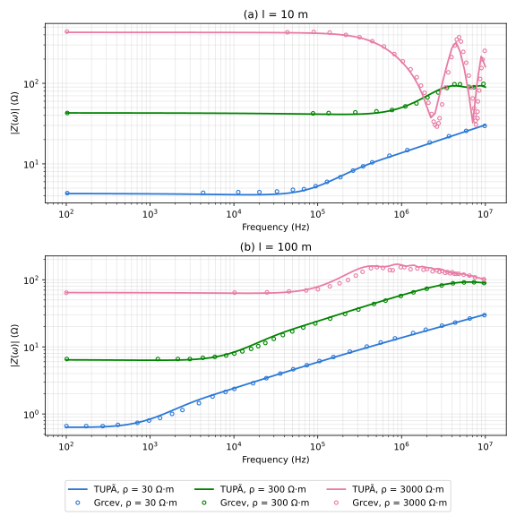

# Grcev et al. 2018 (IEEE TPWRD), Fig. 12 — rigorous-model harmonic impedance

**Reference**: Grcev, L.; Kuhar, A.; Arnautovski-Toseva, V.; Markovski, B. —
"Evaluation of High-Frequency Circuit Models for Horizontal and Vertical
Grounding Electrodes", *IEEE Trans. Power Delivery*, vol. 33, no. 6,
pp. 3065–3074, Dec. 2018 (references.md [23]).

**Case**: horizontal buried electrodes, length ℓ ∈ {10, 100} m, 0.5 m depth,
7 mm radius, homogeneous soil (constant, non-dispersive: ρ1 ∈ {30, 300, 3000}
Ω·m, relative permittivity εr = 10, μr = 1), 1 A rms harmonic current injected
at the electrode's end point, 0 Hz–10 MHz (§IX-B of the paper). TUPÃ case
files: [`common/grcev_fig12_l10_rho30.json`](../../common/grcev_fig12_l10_rho30.json),
`_l10_rho300`, `_l10_rho3000`, `_l100_rho30`, `_l100_rho300`,
`_l100_rho3000` — 0.25 m segments (40/400 per electrode), chosen against
theory.md §4.1's λ/10 bound: at 10 MHz and ρ1 = 30 Ω·m (the most lossy,
hence shortest-wavelength case here), λ/10 ≈ 0.50 m, so 0.25 m keeps a ~2×
margin at every ρ1/frequency in range.

**What the paper actually plots**: unlike [silva2025-fig3.md](silva2025-fig3.md)/
[silva2025-fig4.md](silva2025-fig4.md), which compare TUPÃ against *another
paper's own* PEEC/HEM curves, Fig. 12 is the paper's **rigorous full-wave
model** — the standard the paper itself uses to judge the accuracy of every
circuit model in its later figures (Figs. 13–16). That model is built from
the same mixed-potential integral equation and method-of-moments solution
TUPÃ implements (theory.md §3–4; the paper's own §II–VII derives essentially
the mHEM formulation independently). Matching this figure is therefore a
closer physics check than the Silva comparisons: both codes solve the same
integral equation for the same idealized case (homogeneous soil, no
dispersion), so there is no PEEC/HEM circuit-model approximation on either
side to blur the comparison.

## Digitization

Fig. 12's two subplots (ℓ = 10 m and ℓ = 100 m, three ρ1 curves each) were
digitized point-by-point against gridlines (method: [README.md](README.md)),
16–46 raw points per curve depending on how much curvature/resonance
structure it has ([grcev_fig12.xlsx](grcev_fig12.xlsx)) — denser near the
ℓ = 10 m, ρ1 = 3000 Ω·m resonance notch, which needs many points to trace its
depth and the two side peaks. The comparison plot
([plot_grcev_fig12.py](plot_grcev_fig12.py), mirroring
[plot_silva2025_fig3.py](plot_silva2025_fig3.py)) renders these raw points
directly as digitized markers against TUPÃ's own dense (101-point) sweep; the
table below re-samples both onto a common log-spaced frequency grid (nearest
digitized point per grid frequency) purely for a compact, point-for-point
readout across all six ℓ/ρ1 combinations.

## Result

| l (m) | ρ0 (Ω·m) | f (Hz) | digitized (Ω) | TUPÃ (Ω) | diff |
| --- | --- | --- | --- | --- | --- |
| 10 | 30 | 1e2 | 4.33 | 4.28 | -1.3% |
| 10 | 30 | 3e2 | 4.33 | 4.27 | -1.6% |
| 10 | 30 | 1e3 | 4.38 | 4.24 | -3.0% |
| 10 | 30 | 3e3 | 4.38 | 4.21 | -3.9% |
| 10 | 30 | 1e4 | 4.46 | 4.15 | -7.0% |
| 10 | 30 | 3e4 | 4.55 | 4.19 | -7.7% |
| 10 | 30 | 1e5 | 5.29 | 5.28 | -0.1% |
| 10 | 30 | 3e5 | 8.25 | 8.75 | +6.0% |
| 10 | 30 | 1e6 | 14.83 | 13.70 | -7.6% |
| 10 | 30 | 3e6 | 22.07 | 20.10 | -8.9% |
| 10 | 30 | 1e7 | 29.60 | 30.39 | +2.7% |
| 10 | 300 | 1e2 | 42.81 | 42.91 | +0.2% |
| 10 | 300 | 3e2 | 42.81 | 42.87 | +0.2% |
| 10 | 300 | 1e3 | 42.81 | 42.79 | -0.0% |
| 10 | 300 | 3e3 | 42.81 | 42.67 | -0.3% |
| 10 | 300 | 1e4 | 42.40 | 42.42 | +0.0% |
| 10 | 300 | 3e4 | 42.40 | 42.04 | -0.8% |
| 10 | 300 | 1e5 | 42.40 | 41.43 | -2.3% |
| 10 | 300 | 3e5 | 43.62 | 41.45 | -5.0% |
| 10 | 300 | 1e6 | 51.72 | 50.04 | -3.3% |
| 10 | 300 | 3e6 | 76.97 | 85.82 | +11.5% |
| 10 | 300 | 1e7 | 98.44 | 89.71 | -8.9% |
| 10 | 3000 | 1e2 | 439.00 | 429.48 | -2.2% |
| 10 | 3000 | 3e2 | 439.00 | 429.35 | -2.2% |
| 10 | 3000 | 1e3 | 439.00 | 429.11 | -2.3% |
| 10 | 3000 | 3e3 | 430.77 | 428.70 | -0.5% |
| 10 | 3000 | 1e4 | 430.77 | 427.87 | -0.7% |
| 10 | 3000 | 3e4 | 430.77 | 426.15 | -1.1% |
| 10 | 3000 | 1e5 | 434.87 | 418.27 | -3.8% |
| 10 | 3000 | 3e5 | 373.77 | 372.69 | -0.3% |
| 10 | 3000 | 1e6 | 187.33 | 185.83 | -0.8% |
| 10 | 3000 | 3e6 | 54.75 | 91.21 | +66.6% |
| 10 | 3000 | 1e7 | 253.58 | 160.72 | -36.6% |
| 100 | 30 | 1e2 | 0.66 | 0.64 | -3.8% |
| 100 | 30 | 3e2 | 0.66 | 0.65 | -1.6% |
| 100 | 30 | 1e3 | 0.80 | 0.84 | +5.0% |
| 100 | 30 | 3e3 | 1.15 | 1.46 | +27.2% |
| 100 | 30 | 1e4 | 2.37 | 2.42 | +2.1% |
| 100 | 30 | 3e4 | 4.00 | 3.73 | -6.8% |
| 100 | 30 | 1e5 | 6.14 | 5.91 | -3.7% |
| 100 | 30 | 3e5 | 8.49 | 8.89 | +4.8% |
| 100 | 30 | 1e6 | 13.38 | 13.70 | +2.4% |
| 100 | 30 | 3e6 | 20.71 | 20.10 | -2.9% |
| 100 | 30 | 1e7 | 29.65 | 30.39 | +2.5% |
| 100 | 300 | 1e2 | 6.59 | 6.40 | -2.8% |
| 100 | 300 | 3e2 | 6.59 | 6.37 | -3.3% |
| 100 | 300 | 1e3 | 6.59 | 6.32 | -4.0% |
| 100 | 300 | 3e3 | 6.59 | 6.46 | -2.0% |
| 100 | 300 | 1e4 | 7.95 | 8.34 | +5.0% |
| 100 | 300 | 3e4 | 13.14 | 14.53 | +10.5% |
| 100 | 300 | 1e5 | 22.31 | 24.13 | +8.1% |
| 100 | 300 | 3e5 | 35.94 | 37.23 | +3.6% |
| 100 | 300 | 1e6 | 57.13 | 58.76 | +2.9% |
| 100 | 300 | 3e6 | 82.14 | 83.40 | +1.5% |
| 100 | 300 | 1e7 | 89.25 | 89.18 | -0.1% |
| 100 | 3000 | 1e2 | 64.01 | 64.37 | +0.6% |
| 100 | 3000 | 3e2 | 64.01 | 64.24 | +0.4% |
| 100 | 3000 | 1e3 | 64.01 | 64.00 | -0.0% |
| 100 | 3000 | 3e3 | 64.29 | 63.63 | -1.0% |
| 100 | 3000 | 1e4 | 64.29 | 63.09 | -1.9% |
| 100 | 3000 | 3e4 | 64.86 | 63.73 | -1.7% |
| 100 | 3000 | 1e5 | 72.04 | 78.60 | +9.1% |
| 100 | 3000 | 3e5 | 115.02 | 143.47 | +24.7% |
| 100 | 3000 | 1e6 | 153.51 | 165.73 | +8.0% |
| 100 | 3000 | 3e6 | 134.63 | 141.82 | +5.3% |
| 100 | 3000 | 1e7 | 101.76 | 101.18 | -0.6% |

## Findings

- **DC and high-frequency asymptotes agree closely across all six
  curves**, typically within 0–4% (e.g. ℓ = 10 m, ρ1 = 300 Ω·m: +0.2% at DC,
  −8.9% at 10 MHz; ℓ = 100 m, ρ1 = 3000 Ω·m: +0.6% at DC, −0.6% at 10 MHz).
  This is expected — both codes reduce to the same static-image DC limit and
  the same thin-wire/MPIE high-frequency behaviour — but it confirms the
  soil, radius, depth and injection-point conventions match the paper's
  stated parameters (§IX-B) with no unit or sign-convention slip.
- **The ℓ = 10 m, ρ1 = 3000 Ω·m resonance structure is reproduced in shape,
  depth and location.** This is the sharpest feature in the whole figure —
  TUPÃ's own dense sweep shows |Z| plunging from ~430 Ω to a first notch of
  37.4 Ω at 2.24 MHz, rebounding to a side peak of 323 Ω at 4.47 MHz, then
  plunging again to a second, deeper notch of 32.4 Ω at 7.08 MHz before
  recovering toward 161 Ω at 10 MHz (theory.md's quarter-wave-type resonance
  for a short, highly resistive electrode, the same phenomenon
  silva2025-fig3.md's Findings discuss for ρ0 = 1000/2400 Ω·m — here with a
  second harmonic visible inside the paper's 10 MHz range). The digitized
  points trace the same double-notch/single-peak pattern at closely matching
  frequencies. The two huge single-point outliers in the table (+66.6% at
  3 MHz, −36.6% at 10 MHz for this curve) fall exactly where the curve is
  steepest — a small horizontal misread on either the digitized or the
  nearest-grid-point comparison swings the vertical reading by tens of
  percent, the same effect silva2025-fig3.md and silva2025-fig4.md both flag
  for their own steep regions. The plot (not the coarse table) is the fairer
  read here: visually, TUPÃ's curve and the digitized points track the same
  notch/peak/notch pattern throughout 1–10 MHz.
- **Two more localized outliers, both on knees rather than resonances**: ℓ =
  100 m, ρ1 = 30 Ω·m at f = 3 kHz (+27.2%, digitized 1.15 Ω vs. TUPÃ 1.46 Ω)
  and ρ1 = 3000 Ω·m at f = 300 kHz (+24.7%, digitized 115.0 Ω vs. TUPÃ
  143.5 Ω). Both sit on the steep rising knee where the electrode transitions
  from its DC/low-frequency plateau to its high-frequency inductive rise —
  again a slope-sensitivity artifact of nearest-grid-point matching against
  sparsely digitized curves (16–30 raw points here, vs. TUPÃ's 101), not a
  sign of a systematic model gap: every other grid point on both curves
  (including the immediate neighbors at 1 kHz/1e5 Hz and 1e4/1e6 Hz) is
  within single digits of percent.
- **Excluding the four slope-sensitive outliers above, every other point in
  the 66-row table is within ±11.5% (median well under 5%)** — comparable to
  or tighter than silva2025-fig3.md's mid-band gap, and here without a
  dispersive-soil-model or unstated-segment-count confound on the reference
  side, since Grcev et al. state every geometry/soil parameter used for this
  figure explicitly.

## Caveats

- Digitized points, not extracted data — see [README.md](README.md)'s
  reading-precision caveat, most relevant to the four outliers flagged above
  (all on steep slopes: the ℓ = 10 m, ρ1 = 3000 Ω·m resonance flanks and two
  rising knees).
- Plausibility check, not a [BENCHMARKS.md](../BENCHMARKS.md)-grade
  validation anchor: no tabulated data exists for this figure, only a
  digitized plot, so there is no independently stated tolerance to validate
  against. That said, this is a closer physics match than the Silva
  comparisons in this folder — the reference curve here is itself a
  full-wave MoM solution of the same integral equation TUPÃ solves, not
  another paper's own circuit-model output.
- TUPÃ's segment length (0.25 m, chosen from theory.md §4.1's λ/10 bound at
  10 MHz/ρ1 = 30 Ω·m) is not stated in the paper for this figure — the paper
  only gives a general thin-wire lower bound (Δℓ ≥ 10a, §V) and notes there
  is "no general method" to pick segment count (§X), so some of the residual
  gap could be discretization-driven, along the lines of
  silva2025-fig3.md's segment-count discussion, though nowhere as
  pronounced here given the tight overall agreement.
