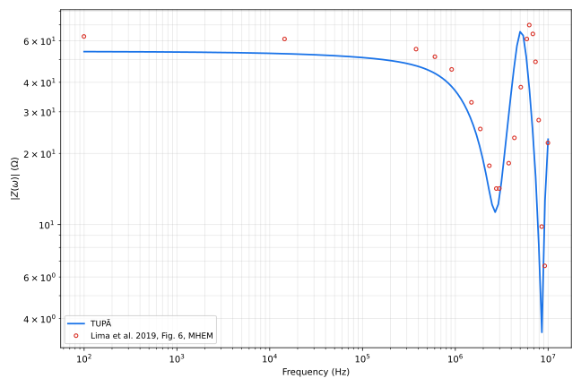

# Lima et al. 2020 (IEEE TEMC), Fig. 6 — Case #9 distribution tower grounding

**Reference**: Lima, A. C. S.; Moura, R. A. R.; Vieira, P. H. N.; Schroeder,
M. A. O.; Correia de Barros, M. T. — "A Computational Improvement in
Grounding Systems Transient Analysis", *IEEE Trans. Electromagn. Compat.*,
vol. 62, no. 3, pp. 765–773, Jun. 2020 (references.md [11]).

**Case #9**: a distribution-tower counterpoise — four horizontal conductors
(6 m each) radiating from a common center, each terminated by a vertical rod
(3 m); a fifth vertical rod at the center, where the 1 A rms harmonic current
is injected (§III-B, Fig. 5(a)). Soil σ1 = 1 mS/m (ρ = 1000 Ω·m), εr = 10,
constant/non-dispersive (both frequency-independent, per §III-B). TUPÃ case
file: [`common/lima_fig6.json`](../../common/lima_fig6.json).

**Inferred geometry** (the paper states arm/rod lengths and topology but not
radius, burial depth, or arm azimuths for this specific case): the four
horizontal arms are modeled 90° apart (a symmetric "+"), matching Fig. 5(a)'s
isometric sketch, which shows a symmetric radiating cross with a vertical
stroke at the center and at each tip — not the arbitrary angles the 2-D
projection first suggests. Radius 12.5 mm (§III-A's single-electrode value,
the closest explicitly stated radius in the same paper; the grids in cases
#10/#11 instead use 7 mm — see Findings for how much this choice matters).
Burial depth: horizontal arms at 0.5 m, vertical rods spanning −0.5 to
−3.5 m, matching this repo's existing convention
([`common/rod.json`](../../common/rod.json)) rather than §III-A's 0.8 m
(stated only for the *single*-electrode tests, §III-A, not restated for
§III-B's grounding systems). Segments: 0.5 m (12 per 6 m arm, 6 per 3 m rod)
— finer than the paper's own λ/6 recommendation (§II-B; ≈1.57 m at
σ = 1 mS/m, εr = 10, 10 MHz) and inside this repo's usual λ/10 budget
(≈0.94 m at the same point) with margin to spare. Frequency sweep: 100 Hz to
10 MHz, 150 log-spaced points (`pointsPerDecade: 29.8`), matching §III-A's
stated single-electrode sweep (not restated for case #9, but consistent with
Fig. 6's plotted range).

**What the paper actually plots**: Fig. 6 has three curves — **MHEM**
(the paper's fast approximate formulation), **HEM** (its full, slower
reference), and **dif** = \|Z_HEM − Z_MHEM\| (an absolute-error diagnostic,
plotted on the same log axis and reaching down to ~10⁻³ Ω). MHEM and HEM are
visually coincident throughout (the paper's point: MHEM matches HEM well
below ~4 MHz, §III-B). Per this task, only **MHEM** was digitized
([Lima_fig6.xlsx](Lima_fig6.xlsx), a single Z column, 21 points) — "dif" is
a derived diagnostic of the paper's own two curves, not an independent
reference for TUPÃ to match, and HEM is redundant with MHEM at this
resolution.

## Result

| f (Hz) | digitized (Ω) | TUPÃ (Ω) | diff |
| --- | --- | --- | --- |
| 1.0e2 | 62.54 | 53.94 | -13.7% |
| 1.4e4 | 61.01 | 52.85 | -13.4% |
| 3.8e5 | 55.27 | 46.99 | -15.0% |
| 6.0e5 | 51.32 | 43.63 | -15.0% |
| 9.1e5 | 45.36 | 38.37 | -15.4% |
| 1.5e6 | 32.90 | 27.58 | -16.2% |
| 1.9e6 | 25.38 | 20.93 | -17.5% |
| 2.3e6 | 17.74 | 13.82 | -22.1% |
| 2.8e6 | 14.20 | 11.60 | -18.3% |
| 3.0e6 | 14.20 | 13.09 | -7.9% |
| 3.8e6 | 18.18 | 29.19 | +60.5% |
| 4.3e6 | 23.28 | 47.24 | +102.9% |
| 5.1e6 | 38.15 | 64.92 | +70.2% |
| 5.9e6 | 61.01 | 48.53 | -20.5% |
| 6.3e6 | 69.89 | 37.86 | -45.8% |
| 6.8e6 | 64.10 | 24.21 | -62.2% |
| 7.3e6 | 48.85 | 16.30 | -66.6% |
| 7.9e6 | 27.67 | 8.36 | -69.8% |
| 8.5e6 | 9.80 | 3.67 | -62.5% |
| 9.2e6 | 6.69 | 11.28 | +68.7% |
| 10.0e6 | 22.16 | 22.15 | -0.0% |

## Findings

- **The qualitative shape matches well.** Both curves stay flat around
  ~50-60 Ω from DC to ~1 MHz, fall through a resonance dip around
  2.3-2.7 MHz, rise to a peak around 5-6 MHz, and fall again through a
  second, deeper dip around 8.5-8.9 MHz before recovering by 10 MHz. TUPÃ's
  own dense (150-point) sweep places its dip/peak/dip at 2.69/4.99/8.57 MHz
  — within 10-15% of the digitized extrema's frequencies (2.3-2.8/5.1-6.3/
  8.5-8.9 MHz) — so the resonance structure is real and correctly located
  in frequency, unlike a case where the whole HF response would be shifted
  by a large factor.
- **A systematic ~13-17% underestimate runs from DC to ~2 MHz**, tightening
  toward the first dip (-13.7% at DC, -15 to -17% through the plateau and
  roll-off). This is flatter and more consistent than the digitization-noise
  outliers flagged in [silva2025-fig3.md](silva2025-fig3.md) and
  [grcev-fig12.md](grcev-fig12.md) — those show *scattered* sign-flipping
  gaps concentrated on steep slopes; this one holds one sign and is largest
  where the digitized curve is nearly flat (easiest to read precisely off
  the plot), pointing at an unresolved modeling or geometry gap rather than
  a reading artifact.
- **Above ~3 MHz, the point-by-point match breaks down** — TUPÃ's resonance
  dip/peak/dip is 1.5-3× deeper/higher than the digitized curve at several
  frequencies (e.g., +102.9% at 4.3 MHz, -69.8% at 7.9 MHz), even though the
  *locations* of the extrema roughly agree (previous finding). A resonance's
  sharpness is far more sensitive than its location to exactly how much
  loss/coupling the model carries between the nine branches — small
  differences in the (unstated) arm geometry, segmentation, or the modified-
  image approximation's high-frequency behavior (the paper's own §II-B
  flags $\lambda/6$ segmentation error growing fastest right in this range)
  are enough to over- or under-damp the resonance without moving its
  frequency much. Per-point percent differences in this region are also
  inflated by both curves passing through small values near the dips (same
  effect as the steep-slope cases in the other writeups, compounded here by
  genuine amplitude mismatch rather than pure misreading).
- **Radius is a secondary but non-negligible factor.** Rerunning with 7 mm
  instead of 12.5 mm radius (§III-B's grid value, the other candidate since
  the paper doesn't state case #9's radius) raises the DC impedance from
  53.9 Ω to 56.5 Ω (+4.8%) — real, but not enough on its own to close the
  ~13-17% low-band gap. Burial depth is a weaker, opposite-signed lever:
  switching to §III-A's 0.8 m single-electrode convention (arms at -0.8 m,
  rods -0.8 to -3.8 m) *lowers* TUPÃ's DC value further, to 52.3 Ω — moving
  away from, not toward, the digitized 62.5 Ω. Neither unstated parameter
  plausibly closes the gap alone.
- **This is the least well-specified case among this folder's comparisons.**
  Unlike the Grcev Fig. 12 comparison ([grcev-fig12.md](grcev-fig12.md)),
  where every geometry/soil parameter is stated explicitly and agreement is
  tight (mostly single-digit percent), Lima et al.'s case #9 leaves radius,
  burial depth, and exact arm azimuths to inference from a schematic. The
  systematic low-band gap and the resonance-sharpness mismatch are
  plausibly explained by some combination of these unstated choices and
  genuine mHEM-vs-MHEM implementation differences (different image-method
  detail, different exact segmentation scheme) — this comparison cannot
  distinguish between them.

## Caveats

- Digitized points, not extracted data — see [README.md](README.md)'s
  reading-precision caveat; 21 points read off a log-log plot with a
  resonance spanning a full decade in |Z|, so the dip/peak values themselves
  carry more reading uncertainty than a flatter curve would.
- Geometry (radius, burial depth, arm azimuths) is inferred, not stated, for
  this specific case — see the sensitivity checks above. This is a more
  significant open gap than any other comparison in this folder.
- Only MHEM was digitized and compared, per this task's scope — HEM (which
  the paper shows as coincident with MHEM below ~4 MHz) and "dif" (a
  derived diagnostic of the paper's own two curves) are not part of this
  comparison.
- Plausibility check, not a [BENCHMARKS.md](../BENCHMARKS.md)-grade
  validation anchor — no tabulated data exists for this figure, and unlike
  [grcev-fig12.md](grcev-fig12.md) or the Silva comparisons, the case's own
  geometry is only partially specified, so a mismatch here is less
  conclusive evidence of a modeling gap than it would be for a fully
  specified case.
