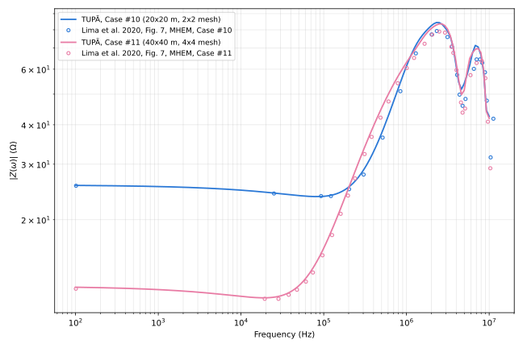

# Lima et al. 2020 (IEEE TEMC), Fig. 7 — Case #10/#11 grounding grids

**Reference**: Lima, A. C. S.; Moura, R. A. R.; Vieira, P. H. N.; Schroeder,
M. A. O.; Correia de Barros, M. T. — "A Computational Improvement in
Grounding Systems Transient Analysis", *IEEE Trans. Electromagn. Compat.*,
vol. 62, no. 3, pp. 765–773, Jun. 2020 (references.md [11]).

**Cases #10 and #11**: two square buried grounding grids of different size,
based on configurations from the paper's [32] (§III-B, Fig. 5(b)/(c)).
Case #10 is a 20×20 m grid, a 2×2 mesh of 10 m electrodes (9 nodes, 12
segments' worth of branches); Case #11 is a 40×40 m grid, a 4×4 mesh (25
nodes, 40 branches) — same 10 m electrode length, just a bigger mesh. Both
use copper conductors, 14 mm diameter (radius 7 mm, stated explicitly),
buried 0.5 m below the surface (stated explicitly). Current is injected at
one corner of the grid (stated explicitly, §III-B). Soil σ = 1 mS/m
(ρ = 1000 Ω·m), εr = 10, both frequency-independent — the same soil used
for case #9 ([lima-fig6.md](lima-fig6.md)), restated in §III-B as shared
across cases #9–#11. Segments: 0.5 m per branch (20 per 10 m electrode),
matching this repo's usual convention (see [lima-fig6.md](lima-fig6.md)) —
finer than the paper's own λ/6 default (§III, "except when mentioned
otherwise") and inside the λ/10 budget, at both cases' shared soil/frequency
point. Frequency sweep: 100 Hz to 10 MHz, 150 log-spaced points
(`pointsPerDecade: 29.8`), matching §III-A's stated sweep (reused for §III-B
per "the harmonic impedance is calculated following the same procedure as
in the previous test cases"). TUPÃ case files:
[`common/lima_fig7_case10.json`](../../common/lima_fig7_case10.json),
[`common/lima_fig7_case11.json`](../../common/lima_fig7_case11.json).

**What the paper actually plots**: Fig. 7 has two subplots, (a) Case #10 and
(b) Case #11, each with the same three curves as Fig. 6 — **MHEM**, **HEM**,
and **dif** = \|Z_HEM − Z_MHEM\|. As with case #9, only **MHEM** was
digitized (one Z column per case in
[Lima_fig7.xlsx](Lima_fig7.xlsx): 25 points for Case #10, 35 for Case #11)
— "dif" is a derived diagnostic of the paper's own two curves, and the
paper states MHEM tracks HEM closely below ~4 MHz regardless.

## Result

### Case #10 (20×20 m, 2×2 mesh)

| f (Hz) | digitized (Ω) | TUPÃ (Ω) | diff |
| --- | --- | --- | --- |
| 1.01e+02 | 25.63 | 25.69 | +0.3% |
| 2.50e+04 | 24.22 | 24.30 | +0.3% |
| 9.28e+04 | 23.77 | 23.70 | -0.3% |
| 1.22e+05 | 23.77 | 23.90 | +0.6% |
| 2.03e+05 | 24.99 | 25.45 | +1.8% |
| 3.03e+05 | 27.81 | 28.79 | +3.5% |
| 5.15e+05 | 36.42 | 38.32 | +5.2% |
| 8.44e+05 | 51.10 | 54.48 | +6.6% |
| 1.30e+06 | 67.35 | 71.42 | +6.0% |
| 2.02e+06 | 77.32 | 82.57 | +6.8% |
| 2.33e+06 | 79.28 | 84.36 | +6.4% |
| 3.13e+06 | 75.88 | 79.34 | +4.6% |
| 3.55e+06 | 70.82 | 72.80 | +2.8% |
| 4.09e+06 | 57.57 | 58.73 | +2.0% |
| 4.38e+06 | 49.84 | 53.70 | +7.7% |
| 4.77e+06 | 45.93 | 52.72 | +14.8% |
| 5.17e+06 | 48.30 | 55.61 | +15.1% |
| 6.53e+06 | 60.16 | 69.42 | +15.4% |
| 7.05e+06 | 64.46 | 71.01 | +10.2% |
| 7.74e+06 | 64.46 | 67.89 | +5.3% |
| 8.25e+06 | 62.86 | 62.64 | -0.3% |
| 8.90e+06 | 58.67 | 51.28 | -12.6% |
| 9.35e+06 | 47.70 | 44.17 | -7.4% |
| 1.04e+07 | 31.52 | 42.53 | +34.9% |
| 1.12e+07 | 41.81 | 42.53 | +1.7% |

### Case #11 (40×40 m, 4×4 mesh)

| f (Hz) | digitized (Ω) | TUPÃ (Ω) | diff |
| --- | --- | --- | --- |
| 1.01e+02 | 12.09 | 12.22 | +1.1% |
| 1.94e+04 | 11.23 | 11.31 | +0.7% |
| 2.84e+04 | 11.23 | 11.43 | +1.8% |
| 3.77e+04 | 11.56 | 11.73 | +1.5% |
| 4.75e+04 | 12.00 | 12.21 | +1.8% |
| 6.09e+04 | 12.73 | 13.06 | +2.6% |
| 7.40e+04 | 13.60 | 14.05 | +3.3% |
| 9.66e+04 | 15.43 | 15.96 | +3.4% |
| 1.26e+05 | 17.88 | 18.63 | +4.2% |
| 1.60e+05 | 20.88 | 21.74 | +4.1% |
| 1.97e+05 | 23.85 | 24.94 | +4.5% |
| 2.39e+05 | 27.04 | 28.46 | +5.2% |
| 3.12e+05 | 32.29 | 33.95 | +5.1% |
| 3.79e+05 | 36.61 | 38.40 | +4.9% |
| 4.86e+05 | 42.13 | 44.47 | +5.6% |
| 6.07e+05 | 47.42 | 50.14 | +5.8% |
| 7.85e+05 | 54.16 | 56.83 | +4.9% |
| 1.01e+06 | 60.51 | 63.18 | +4.4% |
| 1.24e+06 | 65.15 | 68.49 | +5.1% |
| 1.66e+06 | 72.25 | 76.59 | +6.0% |
| 2.05e+06 | 77.21 | 81.21 | +5.2% |
| 2.49e+06 | 78.95 | 83.52 | +5.8% |
| 2.92e+06 | 78.36 | 82.36 | +5.1% |
| 3.49e+06 | 70.66 | 74.37 | +5.2% |
| 3.68e+06 | 67.60 | 70.44 | +4.2% |
| 4.02e+06 | 59.62 | 61.81 | +3.7% |
| 4.56e+06 | 47.07 | 50.79 | +7.9% |
| 4.76e+06 | 43.72 | 50.48 | +15.5% |
| 5.11e+06 | 45.03 | 53.66 | +19.2% |
| 5.95e+06 | 57.46 | 65.69 | +14.3% |
| 7.04e+06 | 62.79 | 69.60 | +10.8% |
| 8.15e+06 | 63.72 | 64.73 | +1.6% |
| 8.99e+06 | 56.20 | 49.39 | -12.1% |
| 9.65e+06 | 40.90 | 42.87 | +4.8% |
| 1.03e+07 | 29.12 | 41.91 | +43.9% |

## Findings

- **This is the closest agreement of the three Lima et al. comparisons in
  this folder.** Both grids reproduce the digitized curve's shape almost
  exactly: a flat DC plateau (25.7 Ω vs. 25.6 Ω for Case #10; 12.2 Ω vs.
  12.1 Ω for Case #11 — both within +1%), a shallow dip around 90-130 kHz,
  a rise through a resonance peak around 2.3-2.5 MHz, a dip around
  4.5-5 MHz, a second smaller peak around 6.5-7 MHz, and a final roll-off —
  the same four-extremum shape the paper's own Fig. 6 (case #9,
  [lima-fig6.md](lima-fig6.md)) shows, but tracked far more tightly here.
- **Below ~4 MHz, agreement is within ±7% almost everywhere** (mostly
  within ±5%), matching the paper's own observation that "a very good
  agreement between results is observed for frequencies below 4 MHz" (§III-B)
  — here that statement is about MHEM vs. HEM, but TUPÃ's independent MHEM
  implementation tracks the digitized MHEM curve just as tightly over the
  same band. This is a marked improvement over case #9's systematic
  -13 to -17% low-band gap ([lima-fig6.md](lima-fig6.md)), consistent with
  case #9 being the one case in the paper with unstated geometry (radius,
  burial depth, arm azimuths) — cases #10/#11 have every parameter stated
  explicitly.
- **Above ~4 MHz, both cases show the same steep increase in mismatch the
  paper describes** ("after these frequency we observe a steep increase in
  the mismatch... the main reason is the nonuniform behavior of
  exp(-γR̄)", §III-B) — errors climb into the 10-19% range through the
  6.5-7 MHz peak, mirroring case #9's high-frequency resonance-sharpness
  divergence. TUPÃ's own dense (150-point) sweep places its Case #10/#11
  peaks and dips at frequencies matching the digitized extrema (e.g. the
  main peak at 2.30 MHz / 2.49 MHz for Case #10/#11 vs. 2.33 MHz / 2.49 MHz
  digitized), so — as with case #9 — the resonance structure's *location*
  is correctly reproduced even where its *amplitude* is not.
- **The single largest error in each table (+34.9% at 1.04e7 Hz for
  Case #10, +43.9% at 1.03e7 Hz for Case #11) sits right at the edge of the
  paper's own stated 100 Hz–10 MHz sweep**, past where TUPÃ's dense curve
  has already rolled off from the second peak. Both digitized series
  include one or two points slightly beyond 1.0e7 Hz (1.12e7 for Case #10),
  suggesting the source plot's rightmost gridline was read slightly past
  its nominal 10 MHz mark — the least reliable points in either table, not
  evidence of a modeling gap.
- **Grid size (Case #10 vs. #11) does not change the qualitative picture.**
  Both grids — 4x smaller area for #10, 4x more branches for #11 — show the
  same low-band tightness and the same high-band mismatch onset near 4 MHz,
  which is consistent with the paper's own Table III showing similar
  Δ(%)/e_rms for #10 and #11 (12.15%/0.105 and 13.22%/0.095 over the full
  100 Hz–10 MHz range, dropping to 3.06%/0.059 and 2.43%/0.053 below 4 MHz)
  — i.e., the mismatch this comparison tracks (TUPÃ vs. digitized MHEM) has
  the same frequency-dependent character as the paper's own internal
  MHEM-vs-HEM mismatch.

## Caveats

- Digitized points, not extracted data — see [README.md](README.md)'s
  reading-precision caveat; the two largest-error points in each table sit
  right at the sweep's upper frequency edge and are the least reliable
  reads in either series (see Findings).
- Only MHEM was digitized and compared, per this task's scope — HEM (which
  the paper shows as coincident with MHEM below ~4 MHz) and "dif" (a
  derived diagnostic of the paper's own two curves) are not part of this
  comparison.
- Plausibility check, not a [BENCHMARKS.md](../BENCHMARKS.md)-grade
  validation anchor — no tabulated data exists for this figure.
