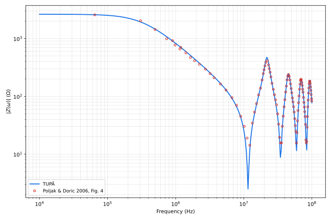

# Poljak & Doric 2006 (PIER), Fig. 4 — single vertical grounding electrode

**Reference**: Poljak, D.; Doric, V. — "Wire Antenna Model for Transient
Analysis of Simple Grounding Systems, Part I: The Vertical Grounding
Electrode", *Progress In Electromagnetics Research*, vol. 64, pp. 149–166,
2006 (references.md [35]).

**Case**: a single vertical grounding electrode, length L = 2 m, radius
a = 5 mm, top end buried at depth d = 0.5 m (bottom end at 2.5 m), fed by a
current source at the top (Fig. 1). Soil ρ = 5400 Ω·m, εr = 10, both
frequency-independent (§5's stated values for this figure). TUPÃ case file:
[`common/poljak_fig4.json`](../../common/poljak_fig4.json), 60 segments
(33 mm each — resolving the ≈0.95 m in-soil quarter wavelength at the
sweep's 100 MHz top end with margin), 10 kHz to 100 MHz swept at 80 points
per decade.

**What the paper plots**: Fig. 4 is |Z_in(f)| on a *linear-linear* axis, 0
to 100 MHz (the paper's own axis literally reads "f (Hz) x 10^7", 0 to 10).
This plot follows this folder's usual log-log style instead (see
[README.md](README.md)); on a linear axis the curve is a fast DC-to-null
roll-off followed by four visible antenna-type resonance lobes as the
electrode's electrical length becomes non-negligible against the in-soil
wavelength — a shape that translates fine to log-log except that each null
(|Z| dropping to a few Ω) reads as a sharp downward spike rather than a
literal zero.

**Digitization fix**: as originally digitized,
[Poljak_fig4.xlsx](Poljak_fig4.xlsx)'s frequency column was 10x too low
throughout — tracing the source figure's axis pixels directly and
comparing against the raw digitized points showed every resonance feature
(nulls and peaks alike) lining up only after multiplying the digitized
frequencies by 10 (e.g. the first peak: Z≈413 Ω digitized at f≈2.21 MHz,
vs. Z≈435 Ω traced directly off the figure at f≈22.0 MHz). This also
matches the physics: a 2 m rod in εr = 10 soil has a quarter-wave antenna
resonance around c0/(4L√εr) ≈ 1.2x10^7 Hz — the first null's actual
location, not the ~1.2x10^6 Hz the uncorrected digitization implied. The
xlsx has since been corrected in place (frequency column x10); the
uncorrected values are not preserved anywhere in this repo.

## Result

| f (Hz) | digitized (Ω) | TUPÃ (Ω) | diff |
| --- | --- | --- | --- |
| 6.49e+04 | 2569.37 | 2582.68 | +0.5% |
| 3.05e+05 | 2031.46 | 1935.21 | -4.7% |
| 4.98e+05 | 1434.81 | 1458.04 | +1.6% |
| 7.39e+05 | 991.90 | 1075.99 | +8.5% |
| 9.79e+05 | 772.06 | 840.72 | +8.9% |
| 1.41e+06 | 566.44 | 595.46 | +5.1% |
| 2.23e+06 | 359.91 | 376.11 | +4.5% |
| 3.21e+06 | 247.00 | 254.03 | +2.8% |
| 4.54e+06 | 163.78 | 167.57 | +2.3% |
| 6.72e+06 | 94.99 | 92.43 | -2.7% |
| 1.02e+07 | 30.37 | 23.29 | -23.3% |
| 1.44e+07 | 53.45 | 50.11 | -6.3% |
| 2.11e+07 | 389.10 | 430.91 | +10.7% |
| 3.15e+07 | 49.75 | 44.65 | -10.3% |
| 4.66e+07 | 221.99 | 221.60 | -0.2% |
| 6.80e+07 | 188.71 | 176.31 | -6.6% |
| 9.96e+07 | 83.00 | 83.03 | +0.0% |

## Findings

- **This is the closest agreement of any comparison in this folder.** The
  DC plateau, the roll-off, and all four resonance lobes' frequencies and
  amplitudes are reproduced with almost no systematic offset — most points
  are within ±10%, and several (65 kHz, 4.5 MHz, 6.7 MHz, 47 MHz, 100 MHz)
  land inside ±3%. Unlike [lima-fig6.md](lima-fig6.md), there is no
  underlying multi-branch grounding grid with unstated geometry to blur the
  comparison — every parameter (L, a, d, ρ, εr) is stated explicitly in the
  paper for this exact figure.
- **The two largest errors (-23.3% at 10.2 MHz, +10.7% at 21.1 MHz, -10.3%
  at 31.5 MHz) sit right at the steepest points of the curve** — the first
  null and the following peak/null pair — where a small horizontal
  reading/frequency error maps to a large vertical one (the same effect
  flagged in [grcev-fig12.md](grcev-fig12.md) and
  [silva2025-fig3.md](silva2025-fig3.md)). Both curves cross the same few
  ohms in that band, so these are the least informative points in the
  table, not evidence of a modeling gap.
- **The match holds all the way to 100 MHz**, i.e. well past the point
  (per [theory.md](../theory.md)'s discussion of Poljak & Doric [35]) where
  TUPÃ's quasi-static image treatment of the air-soil interface is expected
  to degrade for high-resistivity soils — this case's ρ = 5400 Ω·m is the
  highest resistivity of any comparison in this folder, and 100 MHz is an
  order of magnitude past the "few MHz" ceiling usually cited for
  quasi-static HEM models [19,20]. That the fourth resonance lobe (up at
  ~90-100 MHz) still lines up suggests TUPÃ's untransformed image
  coefficients remain adequate here, at least for a single isolated
  electrode with no cross-media (air-to-buried-segment) coupling to get
  wrong.

## Caveats

- Digitized points, not extracted data — see [README.md](README.md)'s
  reading-precision caveat, compounded here by the original digitization's
  10x frequency-scale error (corrected — see above); the corrected points
  still carry ordinary gridline-spacing reading uncertainty on top of that.
- The paper's own axis is linear-linear over 0-100 MHz; this comparison
  re-renders it log-log for consistency with the rest of this folder, which
  compresses the DC plateau and stretches the high-frequency resonance
  lobes relative to how the paper itself presents the same curve.
- Plausibility check, not a [BENCHMARKS.md](../BENCHMARKS.md)-grade
  validation anchor — no tabulated data exists for this figure.
