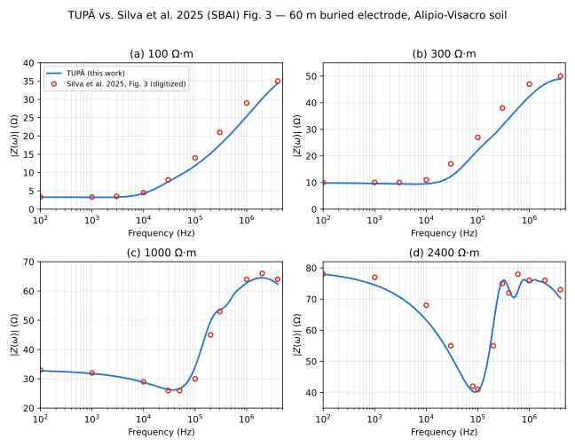

# Silva et al. 2025 (SBAI), Fig. 3 — harmonic impedance comparison

**Reference**: Silva, G. C. P.; Faria, F. A. C.; Moura, R. A. R.; Schroeder,
M. A. O. — "Comparação entre os Métodos PEEC e HEM na Modelagem
Eletromagnética de Aterramentos Elétricos", *XVII Simpósio Brasileiro de
Automação Inteligente (SBAI)*, 2025 (references.md [36]).

**Case**: base case of the paper (§3.1) — buried horizontal electrode,
60 m long, 7 mm radius, 0.5 m depth; frequency-dependent soil per Alipio &
Visacro [14], ρ0 ∈ {100, 300, 1000, 2400} Ω·m; 128 log-spaced frequency
samples, 100 Hz–4 MHz. TUPÃ case files:
[`common/silva2025_rho100.json`](../../common/silva2025_rho100.json),
`_rho300`, `_rho1000`, `_rho2400` — see
[ROADMAP.md §P5](../ROADMAP.md) for the `tVisacroAlipioSoil` implementation
this exercises and [ADR 0007](../adr/0007-soil-dispersion-model.md) for the
model decision record.

**What the paper actually plots**: PEEC and HEM curves for \|Z(ω)\| that
"estão praticamente sobrepostas" (practically overlapping, MAPE < 0.01%) —
Fig. 3 is effectively a single curve per ρ0. TUPÃ is a third, independent
HEM implementation; this comparison checks whether it lands on that same
curve, not whether PEEC and HEM agree with each other (the paper already
established that).

## Digitization

Fig. 3's four subplots were read manually against their gridlines (method:
[../validation/README.md](README.md)) — no tabulated data exists for this
2025 paper. The table below uses a systematic 1-2-5-per-decade frequency
grid (100 Hz to 4 MHz, 15 points) rather than the gridline/extrema-only
picks of an earlier pass, so the comparison plot can render the digitized
reference as a continuous line instead of scattered points; HEM and PEEC
were read as coincident (per the paper's own MAPE < 0.01% claim, confirmed
here — both columns of the source readings match to the read precision).
The evenly-spaced grid does not specifically target the ρ0 = 2400 Ω·m
double-peak (§ Findings) the way the old extrema-picking did, so that
narrow feature is under-resolved here relative to the coarser table below;
TUPÃ's own dip/peak locations quoted in the Findings still come from its
own dense (128-point) sweep, independent of this table's sampling.

## Result

| ρ0 (Ω·m) | f (Hz) | digitized (Ω) | TUPÃ (Ω) | diff |
| --- | --- | --- | --- | --- |
| 100 | 1e2 | 3.5 | 3.28 | −6.4% |
| 100 | 2e2 | 3.5 | 3.26 | −6.8% |
| 100 | 5e2 | 3.5 | 3.24 | −7.6% |
| 100 | 1e3 | 3.5 | 3.22 | −8.1% |
| 100 | 2e3 | 3.5 | 3.22 | −7.9% |
| 100 | 5e3 | 3.6 | 3.48 | −3.2% |
| 100 | 1e4 | 4.0 | 4.32 | +7.9% |
| 100 | 2e4 | 5.5 | 6.11 | +11.1% |
| 100 | 5e4 | 9.0 | 9.24 | +2.6% |
| 100 | 1e5 | 12.5 | 11.90 | −4.8% |
| 100 | 2e5 | 17.5 | 15.25 | −12.8% |
| 100 | 5e5 | 24.0 | 20.69 | −13.8% |
| 100 | 1e6 | 28.5 | 25.40 | −10.9% |
| 100 | 2e6 | 32.5 | 30.19 | −7.1% |
| 100 | 4e6 | 35.0 | 34.36 | −1.8% |
| 300 | 1e2 | 10.0 | 9.84 | −1.6% |
| 300 | 2e2 | 10.0 | 9.81 | −1.9% |
| 300 | 5e2 | 10.0 | 9.73 | −2.7% |
| 300 | 1e3 | 10.0 | 9.65 | −3.5% |
| 300 | 2e3 | 9.8 | 9.53 | −2.7% |
| 300 | 5e3 | 9.6 | 9.40 | −2.1% |
| 300 | 1e4 | 9.6 | 9.52 | −0.8% |
| 300 | 2e4 | 11.0 | 10.62 | −3.4% |
| 300 | 5e4 | 18.0 | 15.94 | −11.4% |
| 300 | 1e5 | 25.0 | 22.19 | −11.2% |
| 300 | 2e5 | 32.0 | 27.75 | −13.3% |
| 300 | 5e5 | 41.0 | 36.19 | −11.7% |
| 300 | 1e6 | 46.0 | 42.34 | −8.0% |
| 300 | 2e6 | 49.0 | 47.01 | −4.1% |
| 300 | 4e6 | 50.0 | 48.89 | −2.2% |
| 1000 | 1e2 | 33.0 | 32.72 | −0.8% |
| 1000 | 2e2 | 32.8 | 32.55 | −0.8% |
| 1000 | 5e2 | 32.5 | 32.21 | −0.9% |
| 1000 | 1e3 | 32.0 | 31.81 | −0.6% |
| 1000 | 2e3 | 31.5 | 31.24 | −0.8% |
| 1000 | 5e3 | 30.5 | 30.08 | −1.4% |
| 1000 | 1e4 | 29.5 | 28.79 | −2.4% |
| 1000 | 2e4 | 28.0 | 27.17 | −2.9% |
| 1000 | 5e4 | 26.5 | 26.63 | +0.5% |
| 1000 | 1e5 | 33.0 | 34.09 | +3.3% |
| 1000 | 2e5 | 52.0 | 49.65 | −4.5% |
| 1000 | 5e5 | 57.0 | 57.39 | +0.7% |
| 1000 | 1e6 | 62.0 | 62.70 | +1.1% |
| 1000 | 2e6 | 65.0 | 64.49 | −0.8% |
| 1000 | 4e6 | 64.0 | 62.32 | −2.6% |
| 2400 | 1e2 | 78.0 | 78.00 | +0.0% |
| 2400 | 2e2 | 77.5 | 77.36 | −0.2% |
| 2400 | 5e2 | 76.5 | 76.04 | −0.6% |
| 2400 | 1e3 | 75.0 | 74.53 | −0.6% |
| 2400 | 2e3 | 72.5 | 72.38 | −0.2% |
| 2400 | 5e3 | 68.0 | 68.08 | +0.1% |
| 2400 | 1e4 | 63.0 | 63.26 | +0.4% |
| 2400 | 2e4 | 56.0 | 56.61 | +1.1% |
| 2400 | 5e4 | 44.0 | 45.07 | +2.4% |
| 2400 | 1e5 | 41.0 | 40.48 | −1.3% |
| 2400 | 2e5 | 73.0 | 61.60 | −15.6% |
| 2400 | 5e5 | 71.0 | 70.47 | −0.7% |
| 2400 | 1e6 | 76.5 | 75.35 | −1.5% |
| 2400 | 2e6 | 76.0 | 75.05 | −1.2% |
| 2400 | 4e6 | 72.0 | 70.27 | −2.4% |

## Findings

- **DC plateau and 4 MHz endpoint agree closely** (within ~0.2-2.4% at
  ρ0 = 300/1000/2400; a steadier ~6-8% at ρ0 = 100, see below) — this is
  the same territory the Sunde/Dwight DC formula already checks (see the
  main session's low-frequency cross-check), so it mostly confirms the
  soil model's DC limit rather than the dispersive behaviour itself.
- **The resonance structure is reproduced, not just the trend.** For
  ρ0 = 1000 Ω·m, TUPÃ's minimum lands at 37.4 kHz / 26.2 Ω against a
  digitized minimum of 26.5 Ω at 5×10⁴ Hz (+0.5%), and its maximum at
  2.05 MHz / 64.5 Ω against a digitized 65.0 Ω at 2×10⁶ Hz (−0.8%). For
  ρ0 = 2400 Ω·m, TUPÃ's minimum is 86.1 kHz / 40.2 Ω against a digitized
  41.0 Ω at 1×10⁵ Hz (−1.3%). This is the finding that matters most: a
  resonance's location and depth are far more sensitive to getting the
  electrode/soil physics right than a DC or high-frequency asymptote is,
  so this is a stronger check than the endpoint agreement — and with this
  denser table the fit through the whole ρ0 = 1000 Ω·m dip-and-peak is
  tight everywhere (|diff| ≤ 4.5%).
- **One outlier, at ρ0 = 2400 Ω·m, f = 2×10⁵ Hz: −15.6%** (digitized 73.0 Ω
  vs. TUPÃ 61.6 Ω). This sits right after the resonance minimum, on the
  steep initial rebound — TUPÃ's own dense sweep shows that rebound isn't
  monotonic (a first, lower local peak near 3×10⁵ Hz, a dip, then the
  higher peak the paper also reports near 6×10⁵ Hz per the earlier,
  extrema-targeted digitization pass), so a single sample at 2×10⁵ Hz on
  either curve can land well off the other on this stretch. Coarser
  evidence than a modelling gap: the 1-2-5-per-decade grid used here has
  no second sample between 1×10⁵ and 5×10⁵ Hz to confirm whether the
  digitized reference is tracking the same double-peak shape or a
  straight-line interpolation artifact of sparse sampling.
- **The mid-band knee runs up to ~14% off for ρ0 = 100/300 Ω·m** — the
  low-resistivity cases, which have no resonance and just rise smoothly.
  ρ0 = 100 Ω·m additionally sits a steady 6-8% low from DC to ~2 kHz; this
  flat region is easy to read precisely off the plot (no steep-slope
  ambiguity), but the gap is only ~0.2 Ω in absolute terms, comparable to
  this table's ~0.5 Ω rounding — so it's suggestive rather than
  conclusive on its own. Combined with the larger (10-14%) gaps on the
  rising knee itself (steepest slope, so a small horizontal misreading
  maps to a large vertical one — the least reliable part of the
  digitization) a real, smaller gap plausibly remains underneath the
  reading noise; see the segment-count corroboration below. Candidate
  causes: the paper does not state its electrode segment count (TUPÃ uses
  60 × 1 m segments here); Alipio &
  Visacro [14] publish three parameter sets (mean / relatively
  conservative / conservative) and the paper does not say which one it
  used (TUPÃ implements only the mean set — ADR 0007); or a genuine
  modelling difference between PEEC/HEM's transverse-field discretization
  and TUPÃ's mHEM geometry factors (theory.md §4).
- **The segment-count candidate cause has independent, if indirect,
  corroboration.** Silva's own MSc dissertation [49] (the dissertation
  behind this SBAI paper) dedicates §5.3 to exactly this question for the
  same electrode/soil family (horizontal buried electrode, Alipio-Visacro
  dispersive soil, pulse/piecewise-constant HEM basis — same basis TUPÃ
  uses per theory.md §4): it takes "10r" segment length (10× electrode
  radius, ≈0.07 m for the paper's 7 mm radius) as its converged reference
  and shows that coarser discretizations *systematically underestimate*
  |Z(ω)| — the same direction as most of the mid-band gap above (the
  ρ0 = 300 Ω·m knee is negative throughout; ρ0 = 100 Ω·m is mixed, with a
  brief +7-11% overshoot right at the knee's onset, 1-2×10⁴ Hz, before
  turning negative further up). Their coarsest tested tier (segment
  length a tenth of the shortest excited wavelength, λ/10) lands at
  0.99-1.96 m depending on ρ0 — the same order as TUPÃ's fixed 1 m
  segments here — and shows 5.2-7.3%
  MAPE against the 10r reference (dissertation Tables 5.4/5.5), even
  though that comparison used a 30 m/effective-length electrode and
  ρ0 ∈ {100, 1000, 2500, 5000} Ω·m, not this case's 60 m/{100, 300, 1000,
  2400} Ω·m — so it's suggestive, not a direct replication. It does mean
  TUPÃ's segmentation (chosen against [19]'s much looser "up to 1000·r₀"
  acceptance criterion, tuned for ≤10% GPR-peak error) is expected to sit
  several percent away from a fully converged HEM solution on its own
  terms, before any digitization noise or paper-side unknowns — a
  meaningfully sized chunk of the observed mid-band gap, though the
  dissertation's own numbers don't cover enough of the gap's range to
  call it the sole cause.

## Caveats

- Digitized points, not extracted data — see
  [../validation/README.md](README.md) for the reading-precision caveat;
  this table's round-numbered values (nearest ~0.5 Ω) suggest an eyeballed
  rather than pixel-traced reading, so treat the single-point outlier
  (ρ0 = 2400 Ω·m, f = 2×10⁵ Hz, −15.6%, see Findings) as suspect before
  treating it as a model defect.
- No independent confirmation of the paper's segment count or Alipio-
  Visacro parameter set — both are plausible sources of the mid-band gap
  above and neither is settled by this comparison.
- This is a plausibility check, not a formal validation anchor (it isn't
  in [BENCHMARKS.md](../BENCHMARKS.md)'s anchor table criteria — no
  tabulated data, no stated tolerance in advance). It's evidence the model
  is behaving correctly, not proof to the tolerance BENCHMARKS.md's other
  anchors require.
