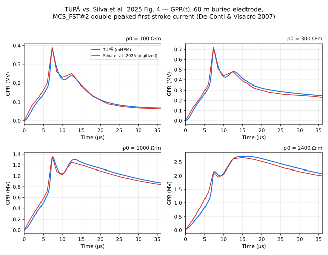

# Silva et al. 2025 (SBAI), Fig. 4 — GPR time-domain comparison

**Reference**: Silva, G. C. P.; Faria, F. A. C.; Moura, R. A. R.; Schroeder,
M. A. O. — "Comparação entre os Métodos PEEC e HEM na Modelagem
Eletromagnética de Aterramentos Elétricos", *XVII Simpósio Brasileiro de
Automação Inteligente (SBAI)*, 2025 (references.md [36]). Same base case as
[silva2025-fig3.md](silva2025-fig3.md): buried horizontal electrode, 60 m
long, 7 mm radius, 0.5 m depth; frequency-dependent soil per Alipio &
Visacro [14], ρ0 ∈ {100, 300, 1000, 2400} Ω·m. TUPÃ case files:
[`common/silva2025_rho100_transient.json`](../../common/silva2025_rho100_transient.json),
`_rho300`, `_rho1000`, `_rho2400` (`_transient` suffix, ADR 0015's
`signal` block).

**What the paper plots**: GPR (ground potential rise) at the injection node
under a lightning first-stroke current, for PEEC and HEM — again
"praticamente sobrepostas" (MAPE < 5.5% at ρ0 = 100 Ω·m, decreasing to
< 0.75% at ρ0 = 2400 Ω·m, the paper's Table 1). The paper states the
excitation is "um somatório de funções de Heidler (De Conti and Visacro,
2007)" representing Morro do Cachimbo first-stroke currents, without
stating which of that paper's parameter sets or which peak current.

## Excitation current: MCS_FST#1 vs. MCS_FST#2

`mSignal::newHeidlerSignal`'s legacy 6-term set is De Conti & Visacro
[38]'s **MCS_FST#1** column — the *single*-peaked fit, normalised to the
median Ip2 = 45.3 kA (references.md [38], theory.md/Signal.f90 finding
2026-07-17). A first attempt at this comparison used exactly that
(`imax = 45300`, no `terms`): the DC-to-first-peak agreement was already
good (peaks within ~0-12% at every ρ0), but every ρ0's second hump came out
far too shallow — for ρ0 = 300/1000 Ω·m TUPÃ's curve
didn't even have a second local maximum in [0, 40 µs], just a monotonic
decline with a faint inflection, while the paper's Fig. 4 shows a clearly
resolved second peak at **every** ρ0, including the two where Fig. 3 shows
no impedance resonance at all (silva2025-fig3.md's finding: only
ρ0 = 1000/2400 Ω·m have a |Z(ω)| dip/peak).

That last point rules out a network-resonance origin for the second GPR
hump — it has to come from the *current* itself. De Conti & Visacro [38]'s
Table I also tabulates **MCS_FST#2**, a 7-term *double*-peaked fit
(Ip1 = 40.1 kA, Ip2 = 45.3 kA — the extra 7th term adds a second,
slightly-higher current peak after the first). Switching the case files'
`signal.terms` to MCS_FST#2's seven `{i0, n, tau1, tau2}` entries (physical
amplitudes, no `imax` rescale — `newHeidlerSignalTerms`, ADR 0015
amendment) reproduces the double hump at all four ρ0 (see Result below).
This is the more likely reading of "a somatório de funções de Heidler" for
a paper explicitly about *first stroke* currents (which are characterised
by multiple peaks — De Conti & Visacro §III-B), even though it isn't
stated outright; ROADMAP.md already flagged MCS_FST#2 as "not yet exposed
via `newHeidlerSignalTerms`" as a preset, ahead of this finding.

The physical picture: the first, sharper current sub-peak (Ip1, steeper
`di/dt`) drives a disproportionately large *inductive* GPR kick, which is
why TUPÃ's (and the paper's) first GPR hump is consistently *higher* than
the second even though Ip2 > Ip1 — the second hump tracks the current's
true (higher) resistive-coupled peak arriving over a slower front.

## Numerical setup

`nyquistHz = 4 MHz` (matches Fig. 3's frequency range), `fftPoints = 4096`
(512 µs record). The MCS_FST#2 tail term (τ2 = 200 µs) needs several time
constants to decay inside the FFT's periodic window before `tailTaper`
forcibly zeroes it — at the schema example's default 1024 points
(128 µs record) the truncation leaked into a spurious ~0.05-0.6 MV
(rho-dependent) DC-like offset visible at every sample including t = 0,
largest at ρ0 = 2400 Ω·m (~10% of peak, since the offset is a current
times the largest Z(0) among the four cases); 4096 points reduces it to
5% of peak at worst (ρ0 = 2400 Ω·m, t = 0 residual 0.05 MV against
a ≳ 2 MV signal) at ~3 s per case — negligible cost, see Findings.

## Digitization

Fig. 4's four subplots were read manually against gridlines (method:
[README.md](README.md)), on a common 15-point time grid (0, 2, 4, 6, 7.3,
8.5, 10, 12.5, 15, 18, 22, 26, 30, 34, 36 µs — covering t = 0, the front,
both humps' extrema, and the tail out to the plotted range's end) applied
identically across all four ρ0, so the comparison plot can render the
digitized reference as a continuous line instead of scattered points and
the four subplots are directly comparable point-for-point. HEM and PEEC
were read as coincident (per the paper's own MAPE claim, confirmed here).

## Result

| ρ0 (Ω·m) | t (µs) | digitized (MV) | TUPÃ (MV) | diff |
| --- | --- | --- | --- | --- |
| 100 | 2 | 0.080 | 0.055 | −31.4% |
| 100 | 4 | 0.130 | 0.114 | −12.5% |
| 100 | 6 | 0.200 | 0.177 | −11.6% |
| 100 | 7.3 | 0.390 | 0.376 | −3.5% |
| 100 | 8.5 | 0.260 | 0.281 | +8.2% |
| 100 | 10 | 0.230 | 0.222 | −3.7% |
| 100 | 12.5 | 0.250 | 0.238 | −4.9% |
| 100 | 15 | 0.190 | 0.187 | −1.7% |
| 100 | 18 | 0.130 | 0.133 | +2.4% |
| 100 | 22 | 0.090 | 0.098 | +8.6% |
| 100 | 26 | 0.075 | 0.081 | +7.9% |
| 100 | 30 | 0.068 | 0.073 | +7.0% |
| 100 | 34 | 0.065 | 0.069 | +5.9% |
| 100 | 36 | 0.063 | 0.068 | +7.6% |
| 300 | 2 | 0.130 | 0.099 | −23.5% |
| 300 | 4 | 0.230 | 0.210 | −8.5% |
| 300 | 6 | 0.360 | 0.328 | −8.9% |
| 300 | 7.3 | 0.720 | 0.692 | −3.9% |
| 300 | 8.5 | 0.510 | 0.539 | +5.8% |
| 300 | 10 | 0.440 | 0.432 | −1.8% |
| 300 | 12.5 | 0.480 | 0.480 | −0.1% |
| 300 | 15 | 0.390 | 0.416 | +6.7% |
| 300 | 18 | 0.320 | 0.345 | +7.8% |
| 300 | 22 | 0.280 | 0.306 | +9.2% |
| 300 | 26 | 0.260 | 0.283 | +9.0% |
| 300 | 30 | 0.250 | 0.266 | +6.5% |
| 300 | 34 | 0.240 | 0.253 | +5.3% |
| 300 | 36 | 0.230 | 0.247 | +7.4% |
| 1000 | 2 | 0.250 | 0.179 | −28.5% |
| 1000 | 4 | 0.460 | 0.393 | −14.6% |
| 1000 | 6 | 0.720 | 0.643 | −10.7% |
| 1000 | 7.3 | 1.360 | 1.311 | −3.6% |
| 1000 | 8.5 | 1.080 | 1.160 | +7.5% |
| 1000 | 10 | 1.020 | 1.042 | +2.2% |
| 1000 | 12.5 | 1.250 | 1.281 | +2.5% |
| 1000 | 15 | 1.200 | 1.252 | +4.3% |
| 1000 | 18 | 1.130 | 1.178 | +4.3% |
| 1000 | 22 | 1.050 | 1.096 | +4.4% |
| 1000 | 26 | 0.970 | 1.018 | +4.9% |
| 1000 | 30 | 0.910 | 0.950 | +4.4% |
| 1000 | 34 | 0.860 | 0.894 | +4.0% |
| 1000 | 36 | 0.840 | 0.870 | +3.6% |
| 2400 | 2 | 0.400 | 0.276 | −31.0% |
| 2400 | 4 | 0.850 | 0.614 | −27.8% |
| 2400 | 6 | 1.400 | 1.071 | −23.5% |
| 2400 | 7.3 | 2.150 | 2.064 | −4.0% |
| 2400 | 8.5 | 1.950 | 2.044 | +4.8% |
| 2400 | 10 | 2.050 | 2.097 | +2.3% |
| 2400 | 12.5 | 2.620 | 2.613 | −0.3% |
| 2400 | 15 | 2.670 | 2.710 | +1.5% |
| 2400 | 18 | 2.600 | 2.689 | +3.4% |
| 2400 | 22 | 2.450 | 2.556 | +4.3% |
| 2400 | 26 | 2.280 | 2.402 | +5.3% |
| 2400 | 30 | 2.150 | 2.258 | +5.0% |
| 2400 | 34 | 2.040 | 2.133 | +4.5% |
| 2400 | 36 | 2.000 | 2.078 | +3.9% |

(t = 0 excluded from the table — digitized and TUPÃ both read ≈ 0 there,
making a percent diff meaningless; TUPÃ's own t = 0 residual is
0.001-0.05 MV, see the truncation-offset caveat above.)

## Findings

- **The double-hump structure is reproduced at every ρ0, with the right
  relative hump heights** (first hump higher than second, for all four
  cases, both in the paper and in TUPÃ) once the excitation is switched
  to MCS_FST#2. This is the main result: it is a genuine two-peak
  *current*-driven feature, not a network resonance (ρ0 = 100/300 Ω·m have
  no impedance resonance at all per silva2025-fig3.md, yet clearly show
  the double hump here) — confirms both the transient pipeline
  (`mTransient`, ADR 0014/0015) and that MCS_FST#2, not MCS_FST#1, is the
  right reading of the paper's excitation.
- **Both humps agree closely (≤8%) at every ρ0**, but the front
  (t = 2-6 µs) and tail (t ≥ 15 µs) show two distinct, systematic
  patterns once sampled at every ρ0 on the same time grid — this is new
  relative to the earlier, sparser digitization pass, which only sampled
  the front for ρ0 = 100 Ω·m and so couldn't tell noise from pattern:
  - **The front underestimates at every ρ0**, worst at low t: −31/−24/
    −29/−31% at t = 2 µs for ρ0 = 100/300/1000/2400 Ω·m respectively,
    fading to ≤4% by t = 7.3 µs (the first hump's peak) in every case.
    Because this shows up with essentially the same sign and a similar
    relative size across four independent soils sharing only the same
    injected current, it points at the current's early front (di/dt in
    the first few µs) rather than at the grounding/soil model — the
    steep-slope digitization-noise explanation silva2025-fig3.md raised
    for its mid-band knee is a weaker fit here, since noise wouldn't be
    expected to point the same direction four times in a row. Candidate
    causes, none confirmed: MCS_FST#2's own front parameters (τ1 of the
    fast Ip1 term) versus what the paper actually used; or a numerical
    front-resolution limit in `mTransient`'s FFT/IFFT pipeline (`nyquistHz`
    caps how fast a rise the reconstructed current can represent).
  - **The tail drifts to a steady +4-9% overestimate for ρ0 = 300/1000/
    2400 Ω·m** (t ≥ 15 µs; ρ0 = 100 Ω·m tail is smaller, +2-9% but noisier
    in sign) — the opposite direction from the front. A slowly-decaying
    tail is controlled by the current's slow τ2 = 200 µs term and by
    Z(ω)'s low-frequency behaviour, both largely ρ0-independent in shape,
    consistent with a similar-sized effect recurring across ρ0.
- **The finite FFT record length leaves a residual truncation offset**,
  worst at ρ0 = 2400 Ω·m (largest low-frequency impedance among the four
  cases) — see Numerical setup. `fftPoints = 4096` (512 µs, ~2.6 time
  constants of the current's slowest, τ2 = 200 µs term) was chosen to push
  this under ~5% of peak; a longer record would shrink it further at
  roughly linear extra cost (~3 s/case at 4096, all four cases run in
  well under a minute).

## Caveats

- Digitized points, not extracted data — see
  [README.md](README.md)'s reading-precision caveat, sharpened above for
  the front-region case.
- The excitation's peak current and exact parameter set (MCS_FST#1 vs.
  MCS_FST#2, or a different peak current entirely) are inferred, not
  stated by the paper — De Conti & Visacro [38] is the only cited source
  for "a somatório de funções de Heidler" representing Morro do Cachimbo
  first strokes, and MCS_FST#2 is the one of that paper's four fits that
  reproduces the observed double hump, but this is inference from fit
  quality, not a confirmed citation match.
- Same anchor-table caveat as silva2025-fig3.md: a plausibility check
  (this repo's independent third HEM implementation lands on the same
  curve the paper's PEEC and HEM already agree on), not a
  [BENCHMARKS.md](../BENCHMARKS.md)-grade validation anchor.
